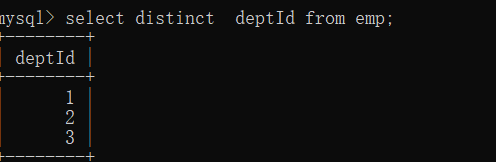

#### 1、字体的应用

##### 	1、地址:

​		https://www.iconfont.cn/

​		阿里的免费的开源的字体库

##### 	2、加入购物车

​	

##### 	3、下载、


##### 4、使用

​	1、引入iconfont.css文件

​	2、引入类即可

```html
<!DOCTYPE html>
<html lang="en">
<head>
    <meta charset="UTF-8">
    <title>Title</title>
    <!--引入-->
    <link rel="stylesheet" href="font/iconfont.css">
    <style>
        h1:hover{
            color: red;
        }
    </style>
</head>
<body>
<!--  引入基础类 iconfont  icon-xxx  -->
  <h1 class="iconfont icon-aixin"></h1>
  <h1 class="iconfont icon-dianzan"></h1>
  <h1 class="iconfont icon-kabao"></h1>
</body>
</html>
```

### 数据库

#####       定义:

​		数据存放的仓库

#####       目的: 

​		存储数据

#####      主流的关系型数据库:  

##### 		类似与表的结构性质

​	   oracle : 运行特别稳定。性能超级好，服务特别周到，特别适合超大型企业。但是收费的。

​	   **mysql:   运行特别稳定。性能超级好		特别适合超大型企业      开源免费的、**

​	    DB2:     速度快，可靠性也好  ，适用于海量数据      收费的

​	    sql  server :  微软的    适用于小企业。	 	    收费的	

#### mysql

##### 	    1、定义、

由瑞典[MySQL AB](https://baike.baidu.com/item/MySQL%20AB/2620844) 公司开发，属于 [Oracle](https://baike.baidu.com/item/Oracle) 旗下产品。MySQL 是最流行的[关系型数据库管理系统](https://baike.baidu.com/item/%E5%85%B3%E7%B3%BB%E5%9E%8B%E6%95%B0%E6%8D%AE%E5%BA%93%E7%AE%A1%E7%90%86%E7%B3%BB%E7%BB%9F/696511)之一，在 [WEB](https://baike.baidu.com/item/WEB/150564) 应用方面，MySQL是最好的 [RDBMS](https://baike.baidu.com/item/RDBMS/1048260) (Relational Database Management System，关系数据库管理系统) 应用软件之一。

MySQL是一种关系型数据库管理系统，关系数据库将数据保存在不同的表中，而不是将所有数据放在一个大仓库内，这样就增加了速度并提高了灵活性。

##### 	   2、历史

​		2008年 mysql ab公司被**sun**公司收购   sun公司再2009年被oracle收购。所以mysql是oracle的。

​		防止mysql也被收费   、mysql的创始人  以他女儿的名字重新copy了一份mysql数据库  改名为   mariadb数据库

##### 	3、关系

​	sql vs数据库 vs数据库管理系统

​	    1  数据库: 库房

​            2  sql: 操作数据库的语言 通过这个sql语法操作的。

 	   3  数据库管理系统:  软件  用于对数据库进行管理控制的  目的是为了确保正常运行和完全性。

#### 数据库下载安装

##### 1、下载

​	 https://dev.mysql.com/downloads/windows/installer/8.0.html

##### 2、选择


##### 3、安装

1、双击打开.msi文件选择 custom


##### 2、安装插件


##### 选择next=>execute


##### 选择execute


##### 等待装好点击next


##### 继续next


##### 继续next


##### 继续next


##### 继续next


##### 注意:

​	 设置密码不要乱设置   统一设置为1234 然后点击next


##### 继续next


##### 选择execute


##### 点击finish


##### 点击next


##### 点击finish


#### 配置系统环境变量

​	1、右键   **我的电脑**  =>属性=>高级系统设置


##### 选择 => 环境变量


##### 编辑 系统变量


##### 新建一个环境变量


点击确定即可

#### 测试安装

​	1、win+r 打开输入cmd窗口

​	2、输入

```
mysql -u root -p   回车
1234 
```

​	


##### 安装成功结果


##### 客户端访问

```
mysql.exe -h主机名  -p端口号    -u用户名   -p密码
本地主机名:127.0.0.1   
端口号:默认是3306
其中 ip和端口、用户名、密码等  工作中老大会给公司的给你。

开发阶段 只需要输入用户名 密码即可
mysql -uroot -p回车
输入密码:xxxx    回车
```

##### 结构:

```
server=> database=>table  =>row,col 
服务器      数据库     表       行、列
```

##### 语法特点

```
1  # 或者是--      表示一行注释    
2 /* 多行注释*/
3  不区分大小写   一般关键词会用大写
4  一行语句如果写完了 一定要末尾加;表示当前语句结束。
5、 关键词之间 需要空格隔开  一个或者多个没有关系

注意:  取名字的时候 不要和关键词 冲突 ex:  show 、delete、 select、use 已经被mysql官方使用了的。
```

#### 常见命令

1、查看数据库

```
show databases;  # 注意中英文分号
```

2、使用某个库

```
use xxx;  # 前提是这个库存在
```

3、退出

```
exit/quit  
```


#### 库的操作

##### 	1、创建一个库

```
create  database dsj;   #创建一个指定的名称的数据库
```

​	

##### 	2、查看是否创建成功

```
show databases; 
```

​	

##### 	3、删除操作(慎用)

```
  drop database dsj;  # 删除指定的数据库名
```


#### 表的操作

ps： 操作表的前提是 先创建或者是先进入到某一个库中

##### 	1、看看当前库有哪些表

```
show tables;
```


##### 	2、创建一个表

```sql
create table student(sid int(8),uname varchar(16));
 创建     表    表名	   字段名 数据类型  ,字段2 数据类型 
 
 创建了一个表叫student 里面有2列 分别是sid 和uname列    
```

​	

##### 	3、查看表的结构

```mysql
desc student;
SHOW FULL FIELDS FROM score;
```


##### 	4、删除表

```mysql
drop table student;  #  删除 表  表名
```


##### 5、修改表的操作

######     1、修改表名

```mysql
alter table  student rename stu;
修改   table   原表名     rename  新名
```


###### 2、修改字段名

​	(理解为列名)

```
alter table stu change sid     uid varchar(16);
alter table 表名  change 旧字段  新字段数据类型;
将stu表中的sid字段改为了 uid字段
```


###### 3、修改字段的数据结构

```sql
alter table stu modify uid int(8);
alter  table 表名  modify  字段名 新的数据结构
将stu表中的uid字段数据结构改为 Int类型
```


###### 4、添加字段(列)

```mysql
-- 给stu表添加了一个sex列 数据结构是varchar;
alter table stu add sex varchar(1);
alter table 表名 add 新字段 数据结构
-- 添加字段时插在某一列之后
alter table stu add sex varchar(1) after uid ;

```


###### 5、删除字段(列)

```sql
alter table  stu drop sex;
alter  table 表名 drop  字段(列名);
删除 stu表中的  sex 列;
```


###### 6、修改字段默认值

```mysql
ALTER TABLE user_info CHANGE COLUMN achievement achievement int DEFAULT 0;
```


#### 6、sql语言分类

**DDL: 数据定义语言** => 用于创建、修改、删除数据**库**中的各种的内容(数据库、表、视图、索引...)

​	   常见的语法词  create、drop、alter、..

**DML:数据操作语言** => 操作数据**表**中的记录 常见 insert(插入)   update(更新), delete(删除)  ...

**DQL:数据查询语言**=>查询数据**表**中的记录    常见  select (查找) ...

**DCL:数据控制语言**=>定义数据库访问权限和安全级别      一般是公司的数据库管理员操作的。


#### 7、基本数据类型

​	 不同的数据类型在计算机底层存储的空间是不一样的、目的为了最大性价比存放数据。避免空间的浪费。

##### 	1、整数类型

​	**int(n)**  : 整数类型     占4个字节

​	**float(m,d)**  m:有效的数字的个数， d:小数后面的位数    占8字节

​		ex:  float(6,3)   匹配的值    123.456        

##### 	2、字符串类型

​		**char(n)**     定义字符串 文本   给了多少个就必须是多少长度

​			ex: char(6)     匹配的是 6位的字符串    多一个不行少一个不行

​				手机号 、 身份证 、固定6位密码  

​			  优势:  执行效率更高

​		**varchar(n)**    匹配1-n之间的字符串 都可以

​			ex:varchar(6)    一个字符串或者是2个或者是6个 都可以满足

​			  适用于不确定字符串个数的

##### 	3、时间类型

​		**year**      只有年份   xxxx 2022

​		**time**      只有时间 的时分秒      11：22：36  

​		**date**      日期:年月日        2022-6-8

​		**now**      当前的系统时间     是一个毫秒数

​		时间 类型都会有有效范围 如果不合法 则为0

###### 格式化时间

```mysql
 date_format(submit_time, '%Y%m')
```


##### 	4、boolean

​			sql中本身是没有bool类型概念，

​			**true=>1**                  **false=>0**


字符串类型


时间类型


常用类型


#### 表的操作

##### 1、查询表的所有的信息操作

```sql
select  * from stu;  # 查看表中有哪些内容
select  所有  from  表名

查询stu表中所有的内容
# 如果没有内容则为空
```

​	

##### 2、插入一行数据到表中

###### insert 

```sql
-- 单行插入
insert  into stu values(1,"jack") ;  #插入的数据必须符合字段要求的数据结构
insert  into 表名 values(字段1,字段2);
insert  into 表名 <字段名> values(字段名对应的值)
-- 多行插入
insert  into stu values (1,"jack"),(2,"tom"),....
```

###### replace

```mysql
-- 替换数据插入,不管数据是否存在都进行插入
replace into stu (1,"jack");
```

##### 3、删除行操作

###### delete 

```mysql
-- 删除表中所有数据

delete from stu;

-- 删除 stu表中 uid=3的行；

delete from stu  where   uid=3;

delete from  表名  where  条件

```

###### truncate

```mysql
-- 删除表中数据并重建新表
truncate table exam_record;
 
-- 查寻表行数和自增字段的值
SELECT table_rows, auto_increment FROM information_schema.tables WHERE table_name='exam_record；
```


##### 4、修改、更新

```sql
update stu set  uname="toomer" where uid=2;
update 表名 set  修改的列    where   条件

找到stu表中 uid=2的行 把uname值改为 toomer 
```

#### 方式2 

通过创建.sql文件的方式 拖入到mysql.exe中

```
mysql -uroot -p < xxx.sql 

```


```
# 这是一个sql文件
/* 这是多行注释*/
# 删除  如果存在的话  如过不想要原来的库和表的情况可以操作
drop database if exists dsj;
#创建库
create database dsj;
#使用库
use dsj;
#创建一个表
create table stu1(
  uid int(6),
  uname  varchar(16),
  sex    char(1)
);
#插入数据
insert into stu1 values(1,"jaak","n");
insert into stu1 values(2,"jackma","n");
insert into stu1 values(3,"rosema","w");

```

##### 中文问题	

```
统一编码格式
1、数据库文件  必须是utf8;
2、数据库存储文档设置 必须是utf8;
3、链接到服务器中 也是必须utf8;
```


```sql
# 这是一个sql文件
/* 这是多行注释*/

#设置ut8格式
set names utf8mb4;
# 删除  如果存在的话  如过不想要原来的库和表的情况可以操作
drop database if exists dsj;
#创建库 同时确保在服务器中是utf8
create database dsj charset=utf8;
#使用库
use dsj;
#创建一个表
create table stu1(
  uid int(6),
  uname  varchar(16),
  sex    char(1)
);
#插入数据
insert into stu1 values(1,"jaak","n");
insert into stu1 values(2,"杰克","n");
insert into stu1 values(3,"rosema","w");
```

```
创建一个dsj02库 如果存在就删掉
创建一个 stu表 分别有 编号、姓名 性别 成绩 电话号码等字段  编号是整数类型、 手机号 性别是固定字段 其他为不固定字段
插入6条以上的数据

//1 查询所有的表中的内容
//2 删掉 编号为3的数据
//3 修改 编号为4的行 把成绩改为 88;
//4 修改表的字段sid 改为uid
//5 删除字段 sex
```

#### 列约束

   约束一列的指定的格式(数据、结构、逻辑) 都符合要求 才能插入到表格中。

##### 1、主键约束

​	定义:   必须包含**唯一值**、并且主键列**不能出现null**值。

​		   **一般原则上一个表中 只有一个 主键约束**

​	特点:  表中的数据 默认按照主键约束列的 值进行从小到大的顺序排列显示。

​		    这么做查询效率加快

```
uid(字段名)   int(6)   primary key;   # 主键约束  唯一 非空      
```


##### 2、唯一约束unique

​	特点:   声明唯一约束的列，从而确保列中的数据是唯一的  但是可以出现多个null值的。

​		  一个表中是可以出现多个唯一的约束的。  手机号唯一 用户名唯一 邮箱唯一 身份证唯一

```
uname  varchar(16) unique;  # 用户名列唯一   否则无法插入成功
tel    char(11)     unique; # 手机号唯一 


```


 唯二约束？？

```
unique(uname,tel)   # uname和tel同时唯一则报错 无法插入
ex:  2个人手机号不一样 但是姓名是一样的 可以通过
```

##### 3、非空约束

​	列中的数据是不允许出现null值的  ，但是可以重复的。

​	注意:  ""空字符串 不是null  2者是有区别的。

```
sex  char(1)  not null,    #不能为空
```


```
新建sql文件
创建一个oracle 库
有1个部门表dept     部门编号、部门的名称  部门的地址   插入3条数据进去
有员工表emp         员工编号  姓名 工资 入职时间  是否在职  所在部门编号   插入6条数据
```


##### 4、默认值约束  default

​	 没有输入值  自动匹配默认值

```sql
ison   int(1)  default 1, # 默认在职

# 插入所有值的情况
insert into emp values(6,'张飞',5500,"2022-3-2",default,3);  

```

##### 可以选择插入部分列的情况  

```sql
insert into emp(eid,ename,salary,wDate,deptId) values(8,'张飞',5500,"2022-3-2",3);
insert into  表名(字段名1,字段名2,....) values(字段值1,值段值2,....);
```

##### 5、外键约束

​	定义: 一个表中的 外键上 可以出现重复的值，可以出现多个null，只要出入的值满足与另一个表的**主键**列上

​	ex: 员工所在的部门编号 必须是部门表中存在的。 否则数据就有问题了

```sql
foreign key (deptId)  references dept (did)
外       键					  参考
foregin key (当前表的约束的列)  references  指定的表 (指定的表中的主键约束列);
```

##### 6、自增约束

​	auto_increment

​	如果希望字段参考上一行自增则可以添加该约束

​	添加了约束 还是支持手动输入的。

```sql
 #  直接给该列 输入null  ok
 insert into emp values(null,'张小叶',5600,"2022-3-2",1,3);
 
 # 插入部分列
 insert into emp(ename,salary,wDate,deptId) values("张笑笑",2500,'2020-12-12',3);
```

##### 7、check约束

```mysql
alter table
  account
add
  constraint check_balance check(balance >= 10);
```


#### 查询

##### 1、普通查询

```
# 查所有;
select * from 表名;
# 查指定列的 
select ename,salary from emp;
```


##### 2、where条件查询

​	 按照指定的条件去查询结果

###### where

```
# 查询一行数据  编号为6的员工的工资和姓名;
select ename,salary from emp where eid=6;
```


###### where     and     

```sql
查询 编号 1-6的员工的数据
select eid,ename,salary from emp where eid>0 and eid<7;
```


###### where      between   and;

```sql
查询 收入在5-8k之间的所有人的信息
select *  from emp where  salary between 5000 and 8000;
```


3、in(n)    在xxx

```sql
# 部门编号为2的 所有人的信息
select * from emp where  deptId in(2);
# 部门编号为2和3的所有人的信息
select * from emp where  deptId in(2,3);
```


#####   子查询

​    2个查询   子查询中用()括起来  优先执行

```mysql
查询 市场部所有的人员信息
select * from emp  where deptId=(select did from dept where dname='市场部');
```


##### 别名

​	起个外号，不会改变原表格的结构， 数据更加方便 其他人查看。

​        语法:      原来的  as    新的

```mysql
# 给员工的姓名添加别名
select ename  as 姓名  from  emp;
#查看所有的
select  eid as 员工编号 ,ename as 姓名, salary as 工资 , wDate as 入职时间, ison as 是否在职, deptId as 所属部门  from  emp;
```


**可以省略as** 

```mysql
select  eid  员工编号 ,ename  姓名, salary 工资 , wDate  入职时间, ison  是否在职, deptId  所属部门  from  emp;
```


去重操作

```mysql
select **distinct**  deptId from emp;
```



##### 思考

​     所有员工当前月的收入  年薪?   涨薪2000之后的  收入？

#####  查询计算

```sql
#   查询 年薪    计算
select ename 姓名,salary 月薪, salary*12 年薪 from emp;
# 研发部的所有员工的姓名和薪资、涨薪2000后的薪资  年薪、是多少？
select  ename 姓名, salary 旧月薪, salary+2000 新月薪, (salary+2000)*12 年薪 from emp where
deptId=(select did from dept where dname='研发部');
```

##### union联合查询

 2个表之间查询结果

​    union  all     查询所有 不会去重

​     union           查询之后去掉重复的值

```
# 查2个表中的部门编号  查所有
select deptId from emp union all select did from dept;
# 查之后 会去重
select deptId from emp union  select did from dept;
```

##### 模糊查询

​    在搜索的时候  根据部分的内容去 检索数据。

​	% 指的是 任意的多字符       可以为"" 

​         _ 指的是  任意的一个字符  不能为""

​	模糊查询不能用=  改为  **like**

```sql
 _ 表示一个字符  必须有
select * from emp where ename like "_小_"  ;   x小x的人名
%  =>0-n个字符
select * from emp where ename like "%小%"  ;    只要有小  都能匹配
select * from emp where ename like "%小_"  ;
```

##### \>ALL(子查询)

###### 大于所有查询的结果

##### 排序查询

​	按照指定的顺序排列

​	order by  xxxxxx    asc  ;     升序排序         可以省略默认是升序

​	order  by xxxxxx    desc;    降序排列    

```sql
#  select * from  表名 order by  排序条件 asc;
#  查询工资升序排列
select * from emp order by  salary asc;
# 工资降序排列
select * from emp order by  salary desc ;

#查询 所有在职员工 按照工资从高到底排
select * from emp where ison=1 order by salary desc; 
# 查询 所有在职员工  按照工资从高到底 如果相同则 按照入职时间先后顺序排列
select * from emp where ison=1 order by salary desc , wDate asc; 
```

##### with as

###### 用来定义一个SQL片断

```python
with A as (select * from class)

​    select *from A  
```


##### 分页查询

   数据很多的情况，一般显示的页面空间是有限的， 一次无法实现显示全部，则可以使用分页。

​    语法:     limit  a,b ;     a: 从a+1行开始    b: 一次最多显示的行数

```sql
select * from emp  limit 0,2;   #从第一行数据开始  最多显示2行数据。

select * from emp  limit 2,2;   #从第3行数据开始  最多显示2行数据。

select * from emp  limit 3;     #从1行开始  显示3行数据

复合分页查询  分页+排序
按照工资排序了  显示前三个工资最高的;
select * from  emp order by salary desc limit 3;

#查询前三行数据， 按照降序排列。
select * from (select * from emp limit 3) as newEmp order by  salary desc;
```

#### 聚合函数

​	min() 最小值   max()最大值   avg()平均值     count() 个数   sum() 求和

```sql
#1号部门的 薪资总和
  select  sum(salary)  from  emp  where deptId=1;
# 求公司员工的个数
  select count(eid) from emp  where ison=1; 
# 2号部门平均薪资   
  select  avg(salary) from emp where deptId=2;
# 全部员工中最高薪资的姓名和薪资输入信息
  select ename,salary from emp where salary=(select max(salary) from emp);
#所有员工中 最先入职的员工的信息
 select * from emp where wDate=(select min(wDate) from emp);
```

##### 分组排序

######     group  by 

​    根据不同的实际情况分组，进行查询

```mysql
#每个部门编号进行分组   最高的薪资是多少
select deptId,max(salary)  from emp group by  deptId;
```

###### having 

聚合条件，跟在group后面，group by和order by一起实用时order by在前面

###### WITH ROLLUP 

将分组计算的结果进行合并，需要给名时用ifnull(返回存在的值，返回不存在的值)

```mysql
SELECT ifnull(year,'3年总和') year,sum(score) from score  GROUP BY year with ROLLUP;
```


#### 连接查询

​      内连接       左连接   右连接

##### 1、内连接

​	  2个表之间的交集     

​     语法       表1   **join     表2     on**     表1和表2的条件,可以多个条件。


```
# 查询 员工姓名 部门名称  分别来自  员工表 和部门表  条件是 员工表的部门编号和部门表的编号是相等的
select ename,dname from emp  join  dept   on   emp.deptId=dept.did;
```

原来的表信息


查询之后是

​	其中 8和9号对于的部门编号是6 不属于dept表中的内容 所以无法查询


##### 2、左连接    

​	特点:  以左边的表为中心  去匹配右边的表中的相同的内容

xxx	   表1   left join    表2    on   条件  


```mysql
# 左连接 : 以左边的表为中心 全部能查询显示的。
# 查询 员工姓名 部门名称  分别来自  员工表 和部门表  条件是 员工表的部门编号和部门表的编号是相等的
select ename,dname from emp  left join  dept   on   emp.deptId=dept.did;
```


结果分析:

​	右边的表中不存的数值   默认以null 显示


##### 3、右连接

​	以右边的表 为中心  去匹配左边的表中 相交的部分

​	   xxx     表1   right join    表2    on    条件


```mysql
# 右连接 : 以右边的表为中心 全部能查询显示的 。
# 查询 员工姓名 部门名称  分别来自  员工表 和部门表  条件是 员工表的部门编号和部门表的编号是相等的
select ename,dname from emp  right join  dept   on   emp.deptId=dept.did;
```

结果:


#### 函数

##### now() 

返回当前时间


##### weekday() 

返回星期几，需要给个时间，返回值0-6，对应星期一到星期天。

查询今天星期几


##### dayname 

返回今天是哪天


##### case 

搜索语句

select case 表达式 when 值 then 返回值 when 值2 then 返回值 2 ... else 返回不满足时的值 end 结束case语句

when 后面接的值是和表达式返回值做对比，如果满足

end 结束case语句

```sql
  select case weekday(now())
	when 0 then '周一' 
	when 1 then '周二'
	when 2 then '周三'
	when 3 then '周四'
	when 4 then '周五'
	when 5 then '周六'
	else '周日'
    end,
	NOW(),
	DAYNAME(NOW());
```

###### 行列转置

在mysql中没有相应的行列转置函数，所以只好使用case或者if函数实现。

```SQL
-- case 函数
select
  student_id,
  sum(
    case
      when subject = '语文' then score
      else 0
    end
  ) '语文',
  sum(
    case
      when subject = '数学' then score
      else 0
    end
  ) '数学',
  sum(
    case
      when subject = '音乐' then score
      else 0
    end
  ) '音乐',
  sum(
    case
      when subject = '美术' then score
      else 0
    end
  ) '美术',
  sum(score) total
from
  score
where
  year = 2019
group by
  student_id;
-- if 函数
select
  student_id,
  sum(if(subject = '语文', score, 0)) '语文',
  sum(if(subject = '数学', score, 0)) '数学',
  sum(if(subject = '音乐', score, 0)) '音乐',
  sum(if(subject = '美术', score, 0)) '美术',
  sum(score) total
from
  score
where
  year = 2019
group by
  student_id;
```

##### length 

取字符长度

```mysql
select
  char_length(name)
from
  account;
```

##### if

(表达式，为真返回值，为假返回值)

```mysql
select
  distinct *
from
  (
    select
      name,
      if (balance > 1000, '有钱', '穷鬼') 有钱否,
      balance
    from
      deal a
      join account b on a.account_id = b.id
  ) a;
```

###### last_day(date)

```mysql
-- 获取一个日期的所在月份的最后一天数
-- 获取当月最后一天
SELECT day(LAST_DAY(NOW()));
```


#### 窗口函数

- 开窗函数与分组聚合比较像，分组聚合是通过制定字段将数据分成多份，每一份执行聚合函数，每份数据返回一条结果。

- 开窗函数也是通过指定字段将数据分成多份，也就是多个窗口，对每个窗口的每一行执行函数，**每个窗口返回等行数的结果。**

- 窗口函数分为静态窗口和滑动窗口，静态窗口的大小是固定的，滑动窗口的大小可以根据设置进行变化，在当前窗口下生成子窗口。

- <窗口函数>：

  1、专用窗口函数，包括后面要讲到的rank, dense_rank, row_number等专用窗口函数。

  2、 聚合函数，如sum. avg, count, max, min等

- 因为窗口函数是对where或者group by子句处理后的结果进行操作，所以**窗口函数原则上只能写在select子句中**。

语法：

```
函数名([参数]) over ([partition by 分组字段] [order by 排序字段 [asc |desc]] [[rows | range] between 起始位置 and 结束位置])
```

特殊的rows参数:

- current row： 边界是当前行
- unbounded preceding： 边界是分区中的第一行
- unbounded following： 边界是分区中的最后一行
- `expr` preceding： 边界是当前行减去expr的值
- `expr` following： 边界是当前行加上expr的值。

```mysql
rows between 2 preceding and current row # 取本行和前面两行
rows between unbounded preceding and current row # 取本行和之前所有的行 
rows between current row and unbounded following # 取本行和之后所有的行 
rows between 3 preceding and 1 following # 从前面三行和下面一行，总共五行 
```

示例：

```mysql
--建表
create table class(id int,classname int,grade int);
--插入数据
insert into
  class
values
  (1, 1, 86),
  (2, 1, 95),
  (3, 2, 89),
  (4, 1, 83),
  (5, 2, 86),
  (6, 3, 92),
  (7, 3, 86),
  (8, 1, 88);
--查询表
SELECT * FROM class;
--按班级升序，成绩倒序
SELECT * from class ORDER BY classname,grade desc;
--按班级排序，成绩倒序，成绩在班级排名
SELECT *,RANK() over (PARTITION by classname ORDER BY grade desc) 
as ranking from class;
--rank()出现一样排名会跳跃，dense_rank()不会。row_number()记录行数。
select *,rank() over (order by grade desc) as ranking, dense_rank() over (order by grade desc) as dense_ranking, row_number() over (order by grade desc) as row_num from class;


```

```mysql
-- mysql
-- 创建新表：学员信息表 student
create table student (
  id int auto_increment primary key,
  num varchar(14) not null,
  name varchar(20) not null,
  sex int,
  age int default 18
);
-- 创建索引
create index idx_student_name on student (name);
create unique index idx_student_num on student (num);
-- 成绩表 score
create table score (
  id int auto_increment primary key,
  student_id int not null,
  year int not null,
  subject varchar(20),
  score int default 0,
  foreign key (student_id) references student (id)
); 
-- 创建唯一复合索引
create unique index idx_score_year_subject on score (student_id, year, subject);

-- 
insert into student (num, name, sex, age) values
('20190001', '周瑜', 1, 16),
('20190002', '小乔', 0, 14),
('20190003', '周泰', 1, 20),
('20190004', '孙权', 1, 16),
('20190005', '刘备', 1, 22),
('20190006', '关羽', 1, 20),
('20190007', '张飞', 1, 19),
('20190008', '孙尚香', 0, 14),
('20190009', '诸葛亮', 1, 16),
('20190010', '黄月英', 1, 14);
-- 生成随机数据
select id, b.year, c.subject, round(30 + rand() * 70) from student a
join 
(select 2019 as year
  union select 2020
  union select 2021) as b
join
(select '数学' as subject 
  union select '语文' 
  union select '音乐' 
  union select '美术') as c

 

-- 求2019年的每个学员的最高分科目

select * from
(select
  a.*,
  b.name,
  rank() over (
    partition by student_id
    order by
      score
  ) ranking
from
  score a
  join student b on a.student_id = b.id
where
  year = 2019) as a 
 where ranking = 1;

-- 所有年份每位学员的最高区域

select * from
(select
  a.*,
  b.name,
  rank() over (
    partition by year,student_id
    order by
      score
  ) ranking
from
  score a
  join student b on a.student_id = b.id
) as a 
 where ranking = 1;

-- 求所有年份总分最高的三位同学

SELECT
	* 
FROM
	(
	SELECT NAME
		,
		amount,
		YEAR,
		RANK() over ( PARTITION BY YEAR ORDER BY amount DESC ) ranking 
	FROM
		( SELECT SUM( score ) amount, student_id, YEAR FROM score GROUP BY student_id, YEAR ) a
		JOIN student b ON a.student_id = b.id 
	) c 
WHERE
	ranking <= 3;
	
-- lag(字段名, 偏移量=1, 默认值=null)，向上进行偏移，查询每年语文成绩都提高的学生；
SELECT
  *
FROM
  (
    SELECT
      NAME,
      YEAR,
      `subject`,
      score,
      LAG(score, 1, 0) over (PARTITION BY student_id) c,
      LAG(score, 2, 0) over (PARTITION BY student_id) d
    FROM
      score a
      JOIN student b ON a.student_id = b.id
    WHERE
      `subject` = '语文'
    ORDER BY
      student_id,
      YEAR
  ) e
WHERE
  score < c
  and c < d;
  
 -- ntile(n) 用于将分组数据按照顺序切分成n片，返回当前切片值。
 -- 求 所有年份总成绩前20%的学员
 select
  *
from
  (
    select
      *,
      ntile(5) over (
        partition by year
        order by
          amount desc
      ) as level
    from
      (
        select
          student_id,
          year,
          sum(score) amount
        from
          score
        group by
          student_id,
          year
      ) a
  ) a
  join student b on a.student_id = b.id
where
  level = 1;
```

#### 索引

##### 创建

###### 普通索引

```mysql
create [unique] index 索引名 on 表名 (列名1 [, 列名2, ...]);

create index idx_duration on examination_info(duration);
```

###### 唯一索引

```mysql
create unique index  uniq_idx_exam_id on examination_info(exam_id);
```

###### 复合索引

```mysql
CREATE  INDEX full_idx_tag ON examination_info(tag,exam_id);
```

###### 全文索引

```mysql
CREATE FULLTEXT INDEX full_idx_tag ON examination_info(tag);
-- 查询字符串
SELECT * FROM examination_info WHERE MATCH(TAG) AGAINST("查询字符串");
```

##### 查看

```
SHOW INDEX FROM examination_info;
```

##### 删除

```mysql
-- 方法一：
alter table examination_info drop index uniq_idx_exam_id;
-- 方法二：
drop index   uniq_idx_exam_id on examination_info;

```


#### 创建视图

```mysql
create view 视图名称 as 查询语句;
CREATE view
  VIEW_name AS
SELECT
  *
FROM
  (
    SELECT
      NAME,
      YEAR,
      `subject`,
      score,
      LAG(score, 1, 0) over (PARTITION BY student_id) c,
      LAG(score, 2, 0) over (PARTITION BY student_id) d
    FROM
      score a
      JOIN student b ON a.student_id = b.id
    WHERE
      `subject` = '语文'
    ORDER BY
      student_id,
      YEAR
  ) e
WHERE
  score < c
  and c < d;
```

#### 触发器

在实际开发中，我们经常会遇到这样的情况：有 2 个或者多个相互关联的表，如 商品信息 和 库存信息 分

别存放在 2 个不同的数据表中，我们在添加一条新商品记录的时候，为了保证数据的完整性，必须同时

在库存表中添加一条库存记录。

这样一来，我们就必须把这两个关联的操作步骤写到程序里面，而且要用 事务 包裹起来，确保这两个操

作成为一个 原子操作 ，要么全部执行，要么全部不执行。要是遇到特殊情况，可能还需要对数据进行手

动维护，这样就很 容易忘记其中的一步 ，导致数据缺失。

这个时候，咱们可以使用触发器。**你可以创建一个触发器，让商品信息数据的插入操作自动触发库存数**

**据的插入操作。**这样一来，就不用担心因为忘记添加库存数据而导致的数据缺失了。

##### **触发器概述**

MySQL从 5.0.2 版本开始支持触发器。MySQL的触发器和存储过程一样，都是嵌入到MySQL服务器的一段程序。

触发器是由 事件来触发 某个操作，这些事件包括 INSERT 、 UPDATE 、 DELETE 事件。所谓事件就是指

用户的动作或者触发某项行为。如果定义了触发程序，当数据库执行这些语句时候，就相当于事件发生

了，就会 自动 激发触发器执行相应的操作。

当对数据表中的数据执行插入、更新和删除操作，需要自动执行一些数据库逻辑时，可以使用触发器来实现。

##### 创建触发器

```mysql
-- new,old
create trigger 触发器名 [before | after] [insert | update | delete] on 表名 for each row <触发器主体>;
create trigger
  insert_deal after
insert
  on deal for each row begin
update
  account
set
  balance = balance + new.money
where
  id = new.account_id
end;
/*
说明：
表名 ：表示触发器监控的对象。
BEFORE|AFTER ：表示触发的时间。BEFORE 表示在事件之前触发；AFTER 表示在事件之后触发。
INSERT|UPDATE|DELETE ：表示触发的事件。
INSERT 表示插入记录时触发；
UPDATE 表示更新记录时触发；
DELETE 表示删除记录时触发
*/
```

```mysql
-- 员工插入薪资时判断是否大于其领导薪资，如果成立，则报sqlstate 'HY000'错误，提示信息为薪资高于领导错误
create trigger salary_check_trigger
    before insert
    on emp
    for each row
begin
    declare manager_salary double;
    select salary into manager_salary from emp where employee_id = new.manager_id;
    if NEW.salary > manager_salary then signal sqlstate 'HY000' set message_text = '薪资高于领导错误'; end if;

end;
```

##### 查看触发器

```mysql
-- 查看触发器
show triggers;
-- 查看具体的触发器
show create trigger salary_check_trigger;
-- 从information_schema表查看
select * from information_schema.TRIGGERS;
```

##### 删除触发器

```mysql
drop triggter salary_check_trigger;
```

##### 触发器的优缺点

**4.1 优点** 

**1、触发器可以确保数据的完整性**。

假设我们用 进货单头表 （

demo.importhead）来保存进货单的总体信息，包括进货单编号、供货商编

号、仓库编号、总计进货数量、总计进货金额和验收日期。

用 进货单明细表 （

demo.importdetails）来保存进货商品的明细，包括进货单编号、商品编号、进货数

量、进货价格和进货金额。

SHOW TRIGGERS\G 

SHOW CREATE TRIGGER 触发器名 

SELECT * FROM information_schema.TRIGGERS; 

DROP TRIGGER IF EXISTS 触发器名称;

每当我们录入、删除和修改一条进货单明细数据的时候，进货单明细表里的数据就会发生变动。这个时

候，在进货单头表中的总计数量和总计金额就必须重新计算，否则，进货单头表中的总计数量和总计金

额就不等于进货单明细表中数量合计和金额合计了，这就是数据不一致。

为了解决这个问题，我们就可以使用触发器，**规定每当进货单明细表有数据插入、修改和删除的操作**

**时，自动触发 2 步操作：**

1）重新计算进货单明细表中的数量合计和金额合计；

2）用第一步中计算出来的值更新进货单头表中的合计数量与合计金额。

这样一来，进货单头表中的合计数量与合计金额的值，就始终与进货单明细表中计算出来的合计数量与

合计金额的值相同，数据就是一致的，不会互相矛盾。

**2、触发器可以帮助我们记录操作日志。**

利用触发器，可以具体记录什么时间发生了什么。比如，记录修改会员储值金额的触发器，就是一个很

好的例子。这对我们还原操作执行时的具体场景，更好地定位问题原因很有帮助。

**3、触发器还可以用在操作数据前，对数据进行合法性检查。**

比如，超市进货的时候，需要库管录入进货价格。但是，人为操作很容易犯错误，比如说在录入数量的

时候，把条形码扫进去了；录入金额的时候，看串了行，录入的价格远超售价，导致账面上的巨亏……

这些都可以通过触发器，在实际插入或者更新操作之前，对相应的数据进行检查，及时提示错误，防止

错误数据进入系统。

**4.2 缺点** 

**1、触发器最大的一个问题就是可读性差。**

因为触发器存储在数据库中，并且由事件驱动，这就意味着触发器有可能 不受应用层的控制 。这对系统

维护是非常有挑战的。

比如，创建触发器用于修改会员储值操作。如果触发器中的操作出了问题，会导致会员储值金额更新失

败。我用下面的代码演示一下：

结果显示，系统提示错误，字段“aa”不存在。

这是因为，触发器中的数据插入操作多了一个字段，系统提示错误。可是，如果你不了解这个触发器，

很可能会认为是更新语句本身的问题，或者是会员信息表的结构出了问题。说不定你还会给会员信息表

添加一个叫“aa”的字段，试图解决这个问题，结果只能是白费力。

**2、相关数据的变更，可能会导致触发器出错。**

特别是数据表结构的变更，都可能会导致触发器出错，进而影响数据操作的正常运行。这些都会由于触

发器本身的隐蔽性，影响到应用中错误原因排查的效率。

**4.3 注意点**

注意，如果在子表中定义了外键约束，并且外键指定了ON UPDATE/DELETE CASCADE/SET NULL子句，此

时修改父表被引用的键值或删除父表被引用的记录行时，也会引起子表的修改和删除操作，此时基于子

表的UPDATE和DELETE语句定义的触发器并不会被激活。

例如：基于子表员工表（

t_employee）的DELETE语句定义了触发器t1，而子表的部门编号（

did）字段定

义了外键约束引用了父表部门表（

t_department）的主键列部门编号（

did），并且该外键加了“ON 

DELETE SET NULL”子句，那么如果此时删除父表部门表（

t_department）在子表员工表（

t_employee）

#### signal sqlstate 自定义错误信息

```mysql
-- 示例
signal sqlstate 'HY000' set message_text = '薪资高于领导错误';
```


#### 创建存储过程

#####  delimiter

######  定义头尾

~~~mysql
- create procedure 过程名([in | out | inout] 参数名1, ...) begin <函数体> end;

```SQL
create procedure delete_deal(in deal_id int)
begin
  delete from deal where id = deal_id;   
end;

call delete_deal(1);
```

-- 创建存储过程

-- delimiter 定义头尾

delimiter $
CREATE PROCEDURE SELECT_all_data()
BEGIN
		SELECT * from stack_working_opp_table;
END$
delimiter ;

~~~

##### CALL

###### 存储过程的调用

```mysql
-- 存储过程的调用

CALL SELECT_all_data();
```

##### OUT

###### 输出一个变量

```mysql
delimiter //
-- OUT 变量名  数据类型
CREATE PROCEDURE min_score ( OUT ms INT ) BEGIN
	SELECT
	--  into 指向变量
		MIN( score ) INTO ms 
	FROM
		score;
	
END // 
delimiter;
#调用函数
CALL min_score ( @ms );
#查询变量值
SELECT
	@ms;
```

##### IN

###### 输入一个变量

```mysql
delimiter //
CREATE PROCEDURE show_student_score (
    -- IN 变量名 数据类型
	IN stu_name VARCHAR ( 20 )) BEGIN
	SELECT NAME
		,
		`year`, 
		`subject`,
		score 
	FROM
		score a
		JOIN student b ON a.student_id = b.id 
	WHERE
		# 可以使用在过滤条件那
		`name` = stu_name;
	
END // 
delimiter;

-- 调用1，直接将参数写入
CALL show_student_score ( '小乔' );

-- 调用2

-- 先设置变量值

SET @stu_name = '小乔';

-- set @stu_name:='小乔';
-- 再传入值
-- 调用函数
CALL show_student_score ( @stu_name );
```

IN 和 OUT

```mysql
delimiter //
CREATE PROCEDURE show_student_score2 ( IN stu_id int, OUT stu_score INT ) BEGIN
	
	SELECT  max(score) INTO stu_score from score where student_id=stu_id;

END // 
delimiter;
# 传参看创建时的位置
CALL show_student_score2(2,@stu_score);

SELECT @stu_score;
```

##### INOUT

###### 输入输出一个参数

```mysql
-- 类型5 INOUT

-- 输出的类型应和传入参数的类型一致

delimiter //

CREATE PROCEDURE stu_name(INOUT stu_id int)
BEGIN

SELECT 	id	INTO stu_id from student WHERE id=stu_id;

END //

delimiter;

set @stu_id=2;

call stu_name(@stu_id);

SELECT @stu_id;
```

#### 创建存储函数

##### returns

###### 返回值的类型

##### DETERMINISTIC

###### 确定

##### CONTAINS SQL

##### 包含sql语句

##### READS SQL DATA

###### 读取sql语句

```mysql
-- 存储函数
-- 类型1

delimiter //

CREATE FUNCTION  id_to_name()

-- 返回类型
RETURNS VARCHAR(25)

-- 如设置了 mysql >set GLOBAL log_bin_trust_function_creators=1 可以写
-- 确定
DETERMINISTIC
-- 包含sql语句
CONTAINS SQL
-- 读取sql数据
READS SQL DATA
BEGIN

RETURN (
			SELECT DISTINCT `NAME`
	FROM
		score a
		JOIN student b ON a.student_id = b.id 
	WHERE
	-- 可以使用在过滤条件那
		student_id = 3
		);
END //

delimiter;

-- 调用

SELECT SELECT_id_to_name(4);

set @stu_id=3

SELECT	SELECT_id_to_name(@stu_id);

-- 类型2

delimiter //

CREATE FUNCTION score_subject(name_1 VARCHAR(25))

RETURNS VARCHAR(25)

BEGIN

RETURN(
SELECT subject from (
SELECT max(score) max_score,subject FROM score  a JOIN student b on a.student_id=b.id 
WHERE `name`=name_1 and score>80 ) c );

END //

delimiter;

SELECT score_subject('小乔');
```

#### 存储过程和函数的查看，修改，删除

##### 查看

###### SHOW CREATE FUNCTION

```mysql
-- \G 美观输出内容

SHOW CREATE FUNCTION id_to_name\G;

SHOW CREATE PROCEDURE min_score\G;
```

###### SHOW PROCEDURE STATUS;

```mysql
-- 查看所有

SHOW PROCEDURE STATUS;

SHOW FUNCTION STATUS;

```

###### SHOW PROCEDURE STATUS  LIKE '%score%';

```mysql
-- 查看需要的

SHOW PROCEDURE STATUS  LIKE '%score%';

SHOW FUNCTION STATUS like '%id%';
```

###### 查看存储过程和函数的信息

```python
SELECT * from information_schema.ROUTINES
where routine_name='stu_name';

SELECT * from information_schema.ROUTINES
where routine_name='id_to_name' AND routine_type='FUNCTION' ;
```

##### 修改

###### ALTER

```mysql
ALTER PROCEDURE max_score 

-- SQL SECURITY 修改权限，INVOKER 有权限的可以使用  DEFINER 创建者可以使用

SQL SECURITY INVOKER

-- 添加注释信息
COMMENT '查询最高工资';
```

##### 删除

###### DROP

```mysql

-- 删除
DROP PROCEDURE IF EXISTS MIN_SCORE;
```

##### 案例

```mysql
CREATE TABLE if not EXISTS admin(
id int PRIMARY KEY auto_increment,
user_name VARCHAR(50) not null,
pwd VARCHAR(50) not null);

delimiter //

CREATE PROCEDURE INSERT_user(IN USER VARCHAR(50),IN pwd VARCHAR(50))

BEGIN

INSERT INTO admin  (user_name,pwd)  VALUES(user,pwd);

END //

delimiter;

CALL insert_user('小明','1234admin');

SELECT * from admin;


CREATE TABLE beauty(
id INT PRIMARY KEY AUTO_INCREMENT,
NAME VARCHAR(15) NOT NULL,
phone VARCHAR(15) UNIQUE,
birth DATE
);


INSERT INTO beauty(NAME,phone,birth)
VALUES
('朱茵','13201233453','1982-02-12'),
('孙燕姿','13501233653','1980-12-09'),
('田馥甄','13651238755','1983-08-21'),
('邓紫棋','17843283452','1991-11-12'),
('刘若英','18635575464','1989-05-18'),
('杨超越','13761238755','1994-05-11');

SELECT * from beauty;

-- 输入id返回名字和号码

delimiter //


CREATE procedure get_phone(in id_1 int,out name_1 VARCHAR(20),OUT phone_1 VARCHAR(20))

BEGIN 

		SELECT name , phone into name_1,phone_1 from beauty WHERE id=id_1;

END //

delimiter;

CALL get_phone(2,@name_1,@phone_1);

SELECT @name_1,@phone_1;

-- 输入时间返回相差天数

delimiter //

CREATE  PROCEDURE  diff_date(in date1 date,in date2 date ,OUT diff_d int )

BEGIN 

		SELECT DATEDIFF(date1,date2) into diff_d;
		
END //

delimiter;

CALL diff_date('2022-9-2','2022-5-15',@diff_d);

SELECT @diff_d;

-- 传入开始和结束位置分页

delimiter //

CREATE PROCEDURE be_limit(in start_index int,in size int)

BEGIN 
			SELECT * from beauty  LIMIT start_index,size;
END // 

delimiter;

CALL be_limit(0,3);


```


#### 正则表达式

```mysql
select order_num,prod_id,quantity 
from OrderItems 
where prod_id 
REGEXP 'BR0[1-3]'
and quantity>100
;
```

#### 创建查询生成的表

```mysql

	SELECT DISTINCT
	*,rank() over (PARTITION  BY `YEAR` ORDER BY
	year,
	s_score DESC) ranking
FROM
	(
	SELECT
		name,
		year,
		s_score 
	FROM
		( SELECT sum( score ) s_score, student_id,year FROM score GROUP BY student_id, year ) a
		JOIN student b ON a.STUDENT_ID = b.id
	) d 
;
	
```

## 变量

### 全局系统变量 Global

#### 查看所有全局变量

```mysql
show global variables
```

#### 查看部分系统变量

```mysql
show global variables like 'xxx'
```

#### 查询全局系统变量

```mysql
-- 查询用户最大连接量
select @@global.max_connections;
-- 查看连接的字符集
SELECT @@global.character_set_client;
```

### 会话变量 session

#### 查看所有会话变量

```mysql
show session variables
```

#### 查看部分会话变量

```mysql
show session variables like 'xxx'
```

查询会话变量

```mysql
-- 查看会话id
SELECT @@session.pseudo_thread_id;
```

### 局部变量

```mysql
delimiter //
create procedure add_value()
begin
-- 定义局部变量
declare value1,value3,value3 int;
-- 赋值
set value1=10;
set value2=20;
set value3=value1+value2;
-- 使用
select value3;
end //
delimiter;
-- 调用 
call add_value();
```


### 修改变量 set 

## 程序出错的处理机制

### 定义条件

```mysql
-- MySQL_error_code
declare Field_Not_Be_Null condition for 1048;
-- sqlstate_value
declare Field_Not_Be_Null condition for SQLSTATE '23000';
```

### 定义处理程序

#### 语法

```mysql
declare 处理方式 handler for 错误类型 处理语句
```

#### 处理方式

##### continue

###### 遇到错误不处理，继续执行

##### exit

###### 遇到错误马上退出

##### undo

###### 遇到错误后撤回之前的操作，MySQL不支持

#### 错误类型

##### SQLSTATE

###### 长度为5的sqlstate_value类型的错误代码

##### MySQL_error_code

###### 匹配数值型错误代码

##### 错误名称

###### declare ...condtion定义的错误条件名称

##### SQLWARNING

###### 匹配所有以01开头的sqlstate错误代码

##### NOT FOUND

###### 匹配所有以02开头的sqlstate错误代码

##### SQLEXCEPTION

###### 匹配没有被sqlwarning或not found捕获的错误代码

#### 处理程序

```mysql
-- 捕获sqlstate_value
declare continue handler for sqlstate '42S02' set @info='NO_SUCH_TABLE';
-- 捕获mysql_error_value
declare continue handler for 1146 set @info='NO_SUCH_TABLE';
-- 先定义条件，再调用
declare no_such_table condition for 1146;
declare continue handler for NO_SUCH_TABLE set @info='NO_SUCH_TABLE';
-- 使用sqlwarning
declare exit handler for sqlwarning set @info='ERROR';
-- 使用not found
declare exit handler for not found set @info='NO_SUCH_TABLE';
-- 使用SQLEXCEPTION
declare exit handler for sqlexception seet @info='ERROR'
```

#### 处理案例

```mysql
delimiter //
create procedure update_insert()
begin
declare continue handler for 1048 set @info=-1;
set @x=1;
update score set id=null where last_name='孙尚香';
set @x=2;
update score set id=null where last_name='孙尚香';
set @x=3;
end //
delimiter;
call update_insert();
select @info,@x;
```

## 分支结构

### IF

```mysql
if 表达式:
	then 成立执行的语句;
else:
-- 可以省略
	不成立执行的预计;
-- 结束语句
end if;

-- 输入员工id并判断工资是否低于8000且入职时间大于5年，如果时则加薪500元

delimiter //
CREATE PROCEDURE update_salary(in_emp_id int)
BEGIN
declare in_salary  DOUBLE;
DECLARE ljsj DOUBLE;
SELECT salary into in_salary FROM emp where emp_id=in_emp_id;
SELECT DATEDIFF(CURDATE,hire_date)/365 into ljsj FROM emp WHERE  emp_id=in_emp_id;
-- 条件判断
if in_salary<8000 and ljsj>=5 
	then update emp set salary=salary+500 WHERE  emp_id=in_emp_id;
end if;

END//
delimiter;
```

### CASE

```mysql
-- case ... WHEN ... then ... 

delimiter //
CREATE PROCEDURE test_case()
BEGIN
DECLARE var int DEFAULT 2;
CASE var
	WHEN 1 THEN
		SELECT 'var=1';
	WHEN 2 THEN
		SELECT 'var=2';
	WHEN 3 THEN
		SELECT 'var=3';
END CASE;

END//
delimiter;
call test_case();
-- CASE when ... then ...
delimiter //
CREATE PROCEDURE test_case2()
BEGIN
DECLARE var1 int DEFAULT 20;
CASE 
		WHEN var1>=100 THEN SELECT '三位数';
		WHEN var1>=10 THEN SELECT '两位数';
		ELSE SELECT '个位数';
END CASE;

END //
delimiter;

CALL test_case2();
```

### LOOP

```mysql
-- loop 循环

delimiter //

CREATE PROCEDURE test_loop(in count int)
BEGIN
		DECLARE var int DEFAULT 1;
		loop_lable:LOOP
					set var=var+1;
					if var>=count THEN LEAVE loop_lable;
					END if;
		END loop loop_lable;
		SELECT var;
END//
delimiter;

call test_loop();

-- 定义初始值2，循环乘以2，当值大于100结束循环

delimiter //
CREATE PROCEDURE test_loop2(OUT num int)
BEGIN
			DECLARE `START` int DEFAULT 2;
			DECLARE count int DEFAULT 0;
			loop_lable: LOOP
						IF START>100 THEN LEAVE loop_lable;
						END IF;
						set `start` =`start`*2;
						set COUNT = COUNT+1;
			END loop loop_lable;
			set num=count;
END //
delimiter;

CALL test_loop2(@out);

SELECT @out;

```

### WHILE

```mysql
-- while

delimiter //
CREATE PROCEDURE test_while()
BEGIN
		DECLARE num int DEFAULT 1;
			while num<10 DO
			SET num=num+1;
		END while;
		SELECT num;
END //

delimiter;

CALL test_while();
```

### REPEAT

```mysql
-- REPEAT
delimiter //
CREATE PROCEDURE test_repeat()
BEGIN
			declare num int default 1;
			REPEAT
						
						set num=num+1;
						SELECT num;
			-- 结束条件
			UNTIL num>10
			END REPEAT;
			
END //
delimiter;
```

### LEAVE

```mysql
-- LEAVE

delimiter //
CREATE PROCEDURE leave_begin(in num int)
begin_lable:BEGIN		
			if num<=0
					-- levea可以不写在循环体中
					THEN leave begin_lable;
			ELSEIF num=1
					THEN SELECT avg(score) FROM score;
			ELSEIF num=2
					THEN SELECT min(score) FROM score;
			ELSE
					SELECT max(score) FROM score;
			END IF;
			SELECT COUNT(*) FROM score;
END //
delimiter;
CALL leave_begin(0);
CALL leave_begin(1);
CALL leave_begin(2);
CALL leave_begin(4);

-- leave2

delimiter //
CREATE PROCEDURE leave_while(out num int)
BEGIN
			declare score INT default 100;
			declare while_count int DEFAULT 0;
			while_lable:while TRUE DO
									IF score<10 THEN LEAVE while_lable;
									END IF;
									set score=score*0.9;
									set while_count =while_count+1;
			END WHILE;
			SET num=while_count;
END //
delimiter;

CALL leave_while(@num);
SELECT @num;
```

### ITERATE

```mysql
-- iterate 继续调用循环

delimiter //
CREATE PROCEDURE test_iterate()
BEGIN
			DECLARE num int DEFAULT 0;
			loop_lable:loop
									set num=num+1;
									-- 满足条件时用ITERATE继续调用循环
									if num<10 then ITERATE loop_lable;
									ELSEIF num>15 THEN LEAVE loop_lable;
									END IF;
									
			END LOOP;
			SELECT 'Hello World!';			
END //
delimiter;

call test_iterate();
```

## 游标CURSOR

### 声明游标

```mysql
DECLARE cursor_name CURSOR FOR select_statement<sql语句>;
```


### 启用游标

```mysql
open cursor_name
```


### 获取数据

```mysql
FETCH cursor_name into var_name [,var_name];
```


### 关闭游标

```mysql
CLOSE cursor_name;
```


```mysql
-- 声明游标;
-- DECLARE cursor_name CURSOR FOR select_statement<sql语句>;
-- 启用游标
-- open cursor_name
-- 获取数据
-- FETCH cursor_name into var_name [,var_name];
-- 关闭游标
-- CLOSE cursor_name

delimiter //
CREATE PROCEDURE a_score_cursor ( IN total_score INT, OUT stu_count INT )
 BEGIN
	DECLARE
		z_score INT DEFAULT 0;
	DECLARE
		s_count INT DEFAULT 0;
	DECLARE
		stu_score INT;
	DECLARE
		sum_score INT;
	DECLARE
		score_cursor CURSOR FOR SELECT
		score 
	FROM
		score 
	ORDER BY
		score DESC;
	SELECT sum(score) into sum_score from score;
	OPEN score_cursor;
	
	loop_lab :LOOP
						IF
							z_score > total_score or z_score = sum_score THEN
								LEAVE loop_lab;
						END IF;
						FETCH score_cursor INTO stu_score;
						
						SET z_score = z_score + stu_score;
						
						SET s_count = s_count + 1;
			
		END LOOP loop_Lab;
		
		SET stu_count = s_count;
		CLOSE score_cursor;
		SELECT z_score;
		
	END // 
delimiter;

CALL a_score_cursor(8000,@count);
SELECT @count;
```

# MySQL8新特性概述

MySQL从5.7版本直接跳跃发布了8.0版本 ，可见这是一个令人兴奋的里程碑版本。MySQL 8版本在功能上

做了显著的改进与增强，开发者对MySQL的源代码进行了重构，最突出的一点是多MySQL Optimizer优化

器进行了改进。不仅在速度上得到了改善，还为用户带来了更好的性能和更棒的体验。

## **1.1 MySQL8.0 新增特性** 

**1. 更简便的NoSQL支持** NoSQL泛指非关系型数据库和数据存储。随着互联网平台的规模飞速发展，传统

的关系型数据库已经越来越不能满足需求。从5.6版本开始，MySQL就开始支持简单的NoSQL存储功能。

MySQL 8对这一功能做了优化，以更灵活的方式实现NoSQL功能，不再依赖模式（

schema）。

**2. 更好的索引** 在查询中，正确地使用索引可以提高查询的效率。MySQL 8中新增了 隐藏索引 和 降序索 

引 。隐藏索引可以用来测试去掉索引对查询性能的影响。在查询中混合存在多列索引时，使用降序索引

可以提高查询的性能。

**3.更完善的JSON支持** MySQL从5.7开始支持原生JSON数据的存储，MySQL 8对这一功能做了优化，增加

了聚合函数 JSON_ARRAYAGG() 和 JSON_OBJECTAGG() ，将参数聚合为JSON数组或对象，新增了行内

操作符 ->>，是列路径运算符 ->的增强，对JSON排序做了提升，并优化了JSON的更新操作。

**4.安全和账户管理** MySQL 8中新增了 caching_sha2_password 授权插件、角色、密码历史记录和FIPS

模式支持，这些特性提高了数据库的安全性和性能，使数据库管理员能够更灵活地进行账户管理工作。

**5.InnoDB的变化** InnoDB是MySQL默认的存储引擎 ，是事务型数据库的首选引擎，支持事务安全表

（

ACID），支持行锁定和外键。在MySQL 8 版本中，InnoDB在自增、索引、加密、死锁、共享锁等方面

做了大量的 改进和优化 ，并且支持原子数据定义语言（

DDL），提高了数据安全性，对事务提供更好的

支持。

**6.数据字典** 在之前的MySQL版本中，字典数据都存储在元数据文件和非事务表中。从MySQL 8开始新增

了事务数据字典，在这个字典里存储着数据库对象信息，这些数据字典存储在内部事务表中。

**7. 原子数据定义语句** MySQL 8开始支持原子数据定义语句（

Automic DDL），即 原子DDL 。目前，只有

InnoDB存储引擎支持原子DDL。原子数据定义语句（

DDL）将与DDL操作相关的数据字典更新、存储引擎

操作、二进制日志写入结合到一个单独的原子事务中，这使得即使服务器崩溃，事务也会提交或回滚。

使用支持原子操作的存储引擎所创建的表，在执行DROP TABLE、CREATE TABLE、ALTER TABLE、 

RENAME TABLE、TRUNCATE TABLE、CREATE TABLESPACE、DROP TABLESPACE等操作时，都支持原子操

作，即事务要么完全操作成功，要么失败后回滚，不再进行部分提交。 对于从MySQL 5.7复制到MySQL 8

版本中的语句，可以添加 IF EXISTS 或 IF NOT EXISTS 语句来避免发生错误。

**8.资源管理** MySQL 8开始支持创建和管理资源组，允许将服务器内运行的线程分配给特定的分组，以便

线程根据组内可用资源执行。组属性能够控制组内资源，启用或限制组内资源消耗。数据库管理员能够

根据不同的工作负载适当地更改这些属性。 目前，CPU时间是可控资源，由“虚拟CPU”这个概念来表

示，此术语包含CPU的核心数，超线程，硬件线程等等。服务器在启动时确定可用的虚拟CPU数量。拥有

对应权限的数据库管理员可以将这些CPU与资源组关联，并为资源组分配线程。 资源组组件为MySQL中

北京宏福校区：010-56253825 

深圳西部硅谷校区：0755-23060254 

上海大江商厦校区：021-57652717的资源组管理提供了SQL接口。资源组的属性用于定义资源组。MySQL中存在两个默认组，系统组和用户

组，默认的组不能被删除，其属性也不能被更改。对于用户自定义的组，资源组创建时可初始化所有的

属性，除去名字和类型，其他属性都可在创建之后进行更改。 在一些平台下，或进行了某些MySQL的配

置时，资源管理的功能将受到限制，甚至不可用。例如，如果安装了线程池插件，或者使用的是macOS

系统，资源管理将处于不可用状态。在FreeBSD和Solaris系统中，资源线程优先级将失效。在Linux系统

中，只有配置了CAP_SYS_NICE属性，资源管理优先级才能发挥作用。

**9.字符集支持** MySQL 8中默认的字符集由 latin1 更改为 utf8mb4 ，并首次增加了日语所特定使用的集

合，utf8mb4_ja_0900_as_cs。 

**10.优化器增强** MySQL优化器开始支持隐藏索引和降序索引。隐藏索引不会被优化器使用，验证索引的必

要性时不需要删除索引，先将索引隐藏，如果优化器性能无影响就可以真正地删除索引。降序索引允许

优化器对多个列进行排序，并且允许排序顺序不一致。

**11.公用表表达式** 公用表表达式（

Common Table Expressions）简称为CTE，MySQL现在支持递归和非递

归两种形式的CTE。CTE通过在SELECT语句或其他特定语句前 使用WITH语句对临时结果集 进行命名。

基础语法如下：

Subquery代表子查询，子查询前使用WITH语句将结果集命名为cte_name，在后续的查询中即可使用

cte_name进行查询。

**12.窗口函数** MySQL 8开始支持窗口函数。在之前的版本中已存在的大部分 聚合函数 在MySQL 8中也可以

作为窗口函数来使用。

**13.正则表达式支持** MySQL在8.0.4以后的版本中采用支持Unicode的国际化组件库实现正则表达式操作，

这种方式不仅能提供完全的Unicode支持，而且是多字节安全编码。MySQL增加了REGEXP_LIKE()、 

EGEXP_INSTR()、REGEXP_REPLACE()和 REGEXP_SUBSTR()等函数来提升性能。另外，regexp_stack_limit和 

regexp_time_limit 系统变量能够通过匹配引擎来控制资源消耗。

**14.内部临时表** TempTable存储引擎取代MEMORY存储引擎成为内部临时表的默认存储引擎 。TempTable存储

引擎为VARCHAR和VARBINARY列提供高效存储。internal_tmp_mem_storage_engine会话变量定义了内部

临时表的存储引擎，可选的值有两个，TempTable和MEMORY，其中TempTable为默认的存储引擎。

temptable_max_ram系统配置项定义了TempTable存储引擎可使用的最大内存数量。

**15.日志记录** 在MySQL 8中错误日志子系统由一系列MySQL组件构成。这些组件的构成由系统变量

log_error_services来配置，能够实现日志事件的过滤和写入。

WITH cte_name (col_name1,col_name2 ...) AS (Subquery) 

SELECT * FROM cte_name;

**16.备份锁** 新的备份锁允许在线备份期间执行数据操作语句，同时阻止可能造成快照不一致的操作。新

备份锁由 LOCK INSTANCE FOR BACKUP 和 UNLOCK INSTANCE 语法提供支持，执行这些操作需要备份管理

员特权。

**17.增强的MySQL复制** MySQL 8复制支持对 JSON文档 进行部分更新的 二进制日志记录 ，该记录 使用紧凑 

的二进制格式 ，从而节省记录完整JSON文档的空间。当使用基于语句的日志记录时，这种紧凑的日志记

录会自动完成，并且可以通过将新的binlog_row_value_options系统变量值设置为PARTIAL_JSON来启用。

**1.2 MySQL8.0移除的旧特性** 

在MySQL 5.7版本上开发的应用程序如果使用了MySQL8.0 移除的特性，语句可能会失败，或者产生不同

的执行结果。为了避免这些问题，对于使用了移除特性的应用，应当尽力修正避免使用这些特性，并尽

可能使用替代方法。

**1. 查询缓存** 查询缓存已被移除 ，删除的项有： **（**

**1）语句：**FLUSH QUERY CACHE和RESET QUERY 

CACHE。 **（**

**2）系统变量：**query_cache_limit、query_cache_min_res_unit、query_cache_size、 

query_cache_type、query_cache_wlock_invalidate。 **（**

**3）状态变量：**Qcache_free_blocks、 

Qcache_free_memory、Qcache_hits、Qcache_inserts、Qcache_lowmem_prunes、Qcache_not_cached、 

Qcache_queries_in_cache、Qcache_total_blocks。 **（**

**4）线程状态：**checking privileges on cached 

query、checking query cache for query、invalidating query cache entries、sending cached result to 

client、storing result in query cache、waiting for query cache lock。 

**2.加密相关** 删除的加密相关的内容有：ENCODE()、DECODE()、ENCRYPT()、DES_ENCRYPT()和 

DES_DECRYPT()函数，配置项des-key-file，系统变量have_crypt，FLUSH语句的DES_KEY_FILE选项，

HAVE_CRYPT CMake选项。 对于移除的ENCRYPT()函数，考虑使用SHA2()替代，对于其他移除的函数，使

用AES_ENCRYPT()和AES_DECRYPT()替代。

**3.空间函数相关** 在MySQL 5.7版本中，多个空间函数已被标记为过时。这些过时函数在MySQL 8中都已被

移除，只保留了对应的ST_和MBR函数。

**4.\N和NULL** 在SQL语句中，解析器不再将\N视为NULL，所以在SQL语句中应使用NULL代替\N。这项变化

不会影响使用LOAD DATA INFILE或者SELECT...INTO OUTFILE操作文件的导入和导出。在这类操作中，NULL

仍等同于\N。 

**5. mysql_install_db** 在MySQL分布中，已移除了mysql_install_db程序，数据字典初始化需要调用带着-- 

initialize或者--initialize-insecure选项的mysqld来代替实现。另外，--bootstrap和INSTALL_SCRIPTDIR 

CMake也已被删除。

**6.通用分区处理程序** 通用分区处理程序已从MySQL服务中被移除。为了实现给定表分区，表所使用的存

储引擎需要自有的分区处理程序。 提供本地分区支持的MySQL存储引擎有两个，即InnoDB和NDB，而在

MySQL 8中只支持InnoDB。 

**7.系统和状态变量信息** 在INFORMATION_SCHEMA数据库中，对系统和状态变量信息不再进行维护。

GLOBAL_VARIABLES、SESSION_VARIABLES、GLOBAL_STATUS、SESSION_STATUS表都已被删除。另外，系

统变量show_compatibility_56也已被删除。被删除的状态变量有Slave_heartbeat_period、 

Slave_last_heartbeat,Slave_received_heartbeats、Slave_retried_transactions、Slave_running。以上被删除

的内容都可使用性能模式中对应的内容进行替代。

**8.mysql_plugin工具** mysql_plugin工具用来配置MySQL服务器插件，现已被删除，可使用--plugin-load或- 

-plugin-load-add选项在服务器启动时加载插件或者在运行时使用INSTALL PLUGIN语句加载插件来替代该

工具。

## **2.窗口函数**

### **2.1 使用窗口函数前后对比**

假设我现在有这样一个数据表，它显示了某购物网站在每个城市每个区的销售额：

查询：

**需求：**现在计算这个网站在每个城市的销售总额、在全国的销售总额、每个区的销售额占所在城市销售

额中的比率，以及占总销售额中的比率。

如果用分组和聚合函数，就需要分好几步来计算。

第一步，计算总销售金额，并存入临时表 a：

查看一下临时表 a ：

第二步，计算每个城市的销售总额并存入临时表 b： 

```mysql
CREATE TABLE sales( 

id INT PRIMARY KEY AUTO_INCREMENT, 

city VARCHAR(15), 

county VARCHAR(15), 

sales_value DECIMAL 

);

INSERT INTO sales(city,county,sales_value) 

VALUES 

('北京','海淀',10.00), 

('北京','朝阳',20.00), 

('上海','黄埔',30.00), 

('上海','长宁',10.00); 
```

mysql> SELECT * FROM sales; 

+----+------+--------+-------------+

| id | city | county | sales_value | 

+----+------+--------+-------------+

| 1 | 北京 | 海淀 | 10 | 

| 2 | 北京 | 朝阳 | 20 | 

| 3 | 上海 | 黄埔 | 30 | 

| 4 | 上海 | 长宁 | 10 | 

+----+------+--------+-------------+

4 rows in set (0.00 sec) 

```mysql
CREATE TEMPORARY TABLE a -- 创建临时表 

SELECT SUM(sales_value) AS sales_value -- 计算总计金额 

FROM sales; 
```

mysql> SELECT * FROM a; 

+-------------+

| sales_value | 

+-------------+

| 70 | 

+-------------+

1 row in set (0.00 sec) 

```mysql
CREATE TEMPORARY TABLE b -- 创建临时表 

SELECT city,SUM(sales_value) AS sales_value -- 计算城市销售合计 

FROM sales 

GROUP BY city;
```

查看临时表 b ：

第三步，计算各区的销售占所在城市的总计金额的比例，和占全部销售总计金额的比例。我们可以通过

下面的连接查询获得需要的结果：

结果显示：市销售金额、市销售占比、总销售金额、总销售占比都计算出来了。

同样的查询，如果用窗口函数，就简单多了。我们可以用下面的代码来实现：

结果显示，我们得到了与上面那种查询同样的结果。

使用窗口函数，只用了一步就完成了查询。而且，由于没有用到临时表，执行的效率也更高了。很显

然，**在这种需要用到分组统计的结果对每一条记录进行计算的场景下，使用窗口函数更好**。 

mysql> SELECT * FROM b; 

+------+-------------+

| city | sales_value | 

+------+-------------+

| 北京 | 30 | 

| 上海 | 40 | 

+------+-------------+

2 rows in set (0.00 sec) 

```mysql
mysql> SELECT s.city AS 城市,s.county AS 区,s.sales_value AS 区销售额,

-> b.sales_value AS 市销售额,s.sales_value/b.sales_value AS 市比率,

-> a.sales_value AS 总销售额,s.sales_value/a.sales_value AS 总比率

-> FROM sales s

-> JOIN b ON (s.city=b.city) -- 连接市统计结果临时表

-> JOIN a -- 连接总计金额临时表

-> ORDER BY s.city,s.county; 


```

+------+------+----------+----------+--------+----------+--------+

| 城市 | 区 | 区销售额 | 市销售额 | 市比率 | 总销售额 | 总比率 | 

+------+------+----------+----------+--------+----------+--------+

| 上海 | 长宁 | 10 | 40 | 0.2500 | 70 | 0.1429 | 

| 上海 | 黄埔 | 30 | 40 | 0.7500 | 70 | 0.4286 | 

| 北京 | 朝阳 | 20 | 30 | 0.6667 | 70 | 0.2857 | 

| 北京 | 海淀 | 10 | 30 | 0.3333 | 70 | 0.1429 | 

+------+------+----------+----------+--------+----------+--------+

4 rows in set (0.00 sec) 

```mysql
mysql> SELECT city AS 城市,county AS 区,sales_value AS 区销售额,

-> SUM(sales_value) OVER(PARTITION BY city) AS 市销售额, -- 计算市销售额

-> sales_value/SUM(sales_value) OVER(PARTITION BY city) AS 市比率,

-> SUM(sales_value) OVER() AS 总销售额, -- 计算总销售额

-> sales_value/SUM(sales_value) OVER() AS 总比率

-> FROM sales

-> ORDER BY city,county; 
```

+------+------+----------+----------+--------+----------+--------+

| 城市 | 区 | 区销售额 | 市销售额 | 市比率 | 总销售额 | 总比率 | 

+------+------+----------+----------+--------+----------+--------+

| 上海 | 长宁 | 10 | 40 | 0.2500 | 70 | 0.1429 | 

| 上海 | 黄埔 | 30 | 40 | 0.7500 | 70 | 0.4286 | 

| 北京 | 朝阳 | 20 | 30 | 0.6667 | 70 | 0.2857 | 

| 北京 | 海淀 | 10 | 30 | 0.3333 | 70 | 0.1429 | 

+------+------+----------+-----------+--------+----------+--------+

4 rows in set (0.00 sec)

### **2.2 窗口函数分类** 

MySQL从8.0版本开始支持窗口函数。窗口函数的作用类似于在查询中对数据进行分组，不同的是，分组

操作会把分组的结果聚合成一条记录，而窗口函数是将结果置于每一条数据记录中。

窗口函数可以分为 静态窗口函数 和 动态窗口函数 。

静态窗口函数的窗口大小是固定的，不会因为记录的不同而不同；

动态窗口函数的窗口大小会随着记录的不同而变化。

MySQL官方网站窗口函数的网址为**https://dev.mysql.com/doc/refman/8.0/en/window-function-descriptio** 

**ns.html#function_row-number**。

窗口函数总体上可以分为序号函数、分布函数、前后函数、首尾函数和其他函数，如下表：


### **2.3 语法结构**

窗口函数的语法结构是：

或者是：

OVER 关键字指定函数窗口的范围。

如果省略后面括号中的内容，则窗口会包含满足WHERE条件的所有记录，窗口函数会基于所

有满足WHERE条件的记录进行计算。

如果OVER关键字后面的括号不为空，则可以使用如下语法设置窗口。

窗口名：为窗口设置一个别名，用来标识窗口。

PARTITION BY子句：指定窗口函数按照哪些字段进行分组。分组后，窗口函数可以在每个分组中分

别执行。

ORDER BY子句：指定窗口函数按照哪些字段进行排序。执行排序操作使窗口函数按照排序后的数据

记录的顺序进行编号。

FRAME子句：为分区中的某个子集定义规则，可以用来作为滑动窗口使用。

函数 OVER（[PARTITION BY 字段名 ORDER BY 字段名 ASC|DESC]） 

函数 OVER 窗口名 … WINDOW 窗口名 AS （[PARTITION BY 字段名 ORDER BY 字段名 ASC|DESC]）

### **2.4 分类讲解**

创建表：

添加数据：

下面针对goods表中的数据来验证每个窗口函数的功能。

#### **1. 序号函数** 

##### **ROW_NUMBER()函数**

ROW_NUMBER()函数能够对数据中的序号进行顺序显示。

举例：查询 goods 数据表中每个商品分类下价格降序排列的各个商品信息。

```mysql
CREATE TABLE goods( 

id INT PRIMARY KEY AUTO_INCREMENT, 

category_id INT, 

category VARCHAR(15), 

NAME VARCHAR(30), 

price DECIMAL(10,2), 

stock INT, 

upper_time DATETIME 

);

INSERT INTO goods(category_id,category,NAME,price,stock,upper_time) 

VALUES 

(1, '女装/女士精品', 'T恤', 39.90, 1000, '2020-11-10 00:00:00'), 

(1, '女装/女士精品', '连衣裙', 79.90, 2500, '2020-11-10 00:00:00'), 

(1, '女装/女士精品', '卫衣', 89.90, 1500, '2020-11-10 00:00:00'), 

(1, '女装/女士精品', '牛仔裤', 89.90, 3500, '2020-11-10 00:00:00'), 

(1, '女装/女士精品', '百褶裙', 29.90, 500, '2020-11-10 00:00:00'), 

(1, '女装/女士精品', '呢绒外套', 399.90, 1200, '2020-11-10 00:00:00'), 

(2, '户外运动', '自行车', 399.90, 1000, '2020-11-10 00:00:00'), 

(2, '户外运动', '山地自行车', 1399.90, 2500, '2020-11-10 00:00:00'), 

(2, '户外运动', '登山杖', 59.90, 1500, '2020-11-10 00:00:00'), 

(2, '户外运动', '骑行装备', 399.90, 3500, '2020-11-10 00:00:00'), 

(2, '户外运动', '运动外套', 799.90, 500, '2020-11-10 00:00:00'), 

(2, '户外运动', '滑板', 499.90, 1200, '2020-11-10 00:00:00'); 

mysql> SELECT ROW_NUMBER() OVER(PARTITION BY category_id ORDER BY price DESC) AS 

row_num,

-> id, category_id, category, NAME, price, stock

-> FROM goods; 

+---------+----+-------------+---------------+------------+---------+-------+

| row_num | id | category_id | category | NAME | price | stock | 

+---------+----+-------------+---------------+------------+---------+-------+

| 1 | 6 | 1 | 女装/女士精品 | 呢绒外套 | 399.90 | 1200 | 

| 2 | 3 | 1 | 女装/女士精品 | 卫衣 | 89.90 | 1500 | 

| 3 | 4 | 1 | 女装/女士精品 | 牛仔裤 | 89.90 | 3500 | 

| 4 | 2 | 1 | 女装/女士精品 | 连衣裙 | 79.90 | 2500 | 

| 5 | 1 | 1 | 女装/女士精品 | T恤 | 39.90 | 1000 | 

| 6 | 5 | 1 | 女装/女士精品 | 百褶裙 | 29.90 | 500 | 

| 1 | 8 | 2 | 户外运动 | 山地自行车 | 1399.90 | 2500 | 

| 2 | 11 | 2 | 户外运动 | 运动外套 | 799.90 | 500 | 

| 3 | 12 | 2 | 户外运动 | 滑板 | 499.90 | 1200 | 

# 
```

举例：查询 goods 数据表中每个商品分类下价格最高的3种商品信息。

```mysql
 SELECT *
FROM (
SELECT ROW_NUMBER() OVER(PARTITION BY category_id ORDER BY price DESC) AS row_num,
id, category_id, category, NAME, price, stock
FROM goods) t
WHERE row_num <= 3;
```

在名称为“女装/女士精品”的商品类别中，有两款商品的价格为89.90元，分别是卫衣和牛仔裤。两款商品

的序号都应该为2，而不是一个为2，另一个为3。此时，可以使用RANK()函数和DENSE_RANK()函数解

决。

##### **2．RANK()函数**

使用RANK()函数能够对序号进行并列排序，并且会跳过重复的序号，比如序号为1、1、3。

举例：使用RANK()函数获取 goods 数据表中各类别的价格从高到低排序的各商品信息。

举例：使用RANK()函数获取 goods 数据表中类别为“女装/女士精品”的价格最高的4款商品信息。

| 5 | 10 | 2 | 户外运动 | 骑行装备 | 399.90 | 3500 | 

| 6 | 9 | 2 | 户外运动 | 登山杖 | 59.90 | 1500 | 

+---------+----+-------------+---------------+------------+---------+-------+

12 rows in set (0.00 sec) 

```mysql
mysql> SELECT *

-> FROM (

-> SELECT ROW_NUMBER() OVER(PARTITION BY category_id ORDER BY price DESC) AS 

row_num,

-> id, category_id, category, NAME, price, stock

-> FROM goods) t

-> WHERE row_num <= 3; 
```

+---------+----+-------------+---------------+------------+---------+-------+

| row_num | id | category_id | category | NAME | price | stock | 

+---------+----+-------------+---------------+------------+---------+-------+

| 1 | 6 | 1 | 女装/女士精品 | 呢绒外套 | 399.90 | 1200 | 

| 2 | 3 | 1 | 女装/女士精品 | 卫衣 | 89.90 | 1500 | 

| 3 | 4 | 1 | 女装/女士精品 | 牛仔裤 | 89.90 | 3500 | 

| 1 | 8 | 2 | 户外运动 | 山地自行车 | 1399.90 | 2500 | 

| 2 | 11 | 2 | 户外运动 | 运动外套 | 799.90 | 500 | 

| 3 | 12 | 2 | 户外运动 | 滑板 | 499.90 | 1200 | 

+---------+----+-------------+---------------+------------+----------+-------+

6 rows in set (0.00 sec) 

可以看到，使用RANK()函数得出的序号为1、2、2、4，相同价格的商品序号相同，后面的商品序号是不

连续的，跳过了重复的序号。

##### **3．DENSE_RANK()函数**

DENSE_RANK()函数对序号进行并列排序，并且不会跳过重复的序号，比如序号为1、1、2。

举例：使用DENSE_RANK()函数获取 goods 数据表中各类别的价格从高到低排序的各商品信息。

Version:0.9 StartHTML:0000000105 EndHTML:0000007017 StartFragment:0000000141 EndFragment:0000006977

mysql> SELECT DENSE_RANK() OVER(PARTITION BY category_id ORDER BY price DESC) AS 

row_num,

-> id, category_id, category, NAME, price, stock

-> FROM goods; 

+---------+----+-------------+---------------+------------+---------+-------+

| row_num | id | category_id | category | NAME | price | stock | 

+---------+----+-------------+---------------+------------+---------+-------+

| 1 | 6 | 1 | 女装/女士精品 | 呢绒外套 | 399.90 | 1200 | 

| 2 | 3 | 1 | 女装/女士精品 | 卫衣 | 89.90 | 1500 | 

| 2 | 4 | 1 | 女装/女士精品 | 牛仔裤 | 89.90 | 3500 | 

| 3 | 2 | 1 | 女装/女士精品 | 连衣裙 | 79.90 | 2500 | 

| 4 | 1 | 1 | 女装/女士精品 | T恤 | 39.90 | 1000 | 

| 5 | 5 | 1 | 女装/女士精品 | 百褶裙 | 29.90 | 500 | 

| 1 | 8 | 2 | 户外运动 | 山地自行车 | 1399.90 | 2500 | 

| 2 | 11 | 2 | 户外运动 | 运动外套 | 799.90 | 500 | 

| 3 | 12 | 2 | 户外运动 | 滑板 | 499.90 | 1200 | 

| 4 | 7 | 2 | 户外运动 | 自行车 | 399.90 | 1000 | 

| 4 | 10 | 2 | 户外运动 | 骑行装备 | 399.90 | 3500 | 

| 5 | 9 | 2 | 户外运动 | 登山杖 | 59.90 | 1500 | 

+---------+----+-------------+---------------+------------+---------+-------+

12 rows in set (0.00 sec) 

```mysql
mysql> SELECT *

-> FROM(

-> SELECT DENSE_RANK() OVER(PARTITION BY category_id ORDER BY price DESC) AS 

row_num,

-> id, category_id, category, NAME, price, stock

-> FROM goods) t

-> WHERE category_id = 1 AND row_num <= 3; 
```

+---------+----+-------------+---------------+----------+--------+-------+

| row_num | id   | category_id | category | NAME | price | stock |
| ------- | ---- | ----------- | -------- | ---- | ----- | ----- |
|         |      |             |          |      |       |       |

Version:0.9 StartHTML:0000000105 EndHTML:0000000575 StartFragment:0000000141 EndFragment:0000000535

可以看到，使用DENSE_RANK()函数得出的行号为1、2、2、3，相同价格的商品序号相同，后面的商品序

号是连续的，并且没有跳过重复的序号。


#### **2. 分布函数** 

##### **PERCENT_RANK()函数**

PERCENT_RANK()函数是等级值百分比函数。按照如下方式进行计算。

其中，rank的值为使用RANK()函数产生的序号，rows的值为当前窗口的总记录数。

举例：计算 goods 数据表中名称为“女装/女士精品”的类别下的商品的PERCENT_RANK值。

```mysql
#写法一： 
SELECT RANK() OVER (PARTITION BY category_id ORDER BY price DESC) AS r, PERCENT_RANK() OVER (PARTITION BY category_id ORDER BY price DESC) AS pr, id, category_id, category, NAME, price, stock FROM goods WHERE category_id = 1;
#写法二： 
 SELECT RANK() OVER w AS r,
PERCENT_RANK() OVER w AS pr,
id, category_id, category, NAME, price, stock
FROM goods
WHERE category_id = 1 WINDOW w AS (PARTITION BY category_id ORDER BY price DESC); +---+-----+----+-------------+---------------+----------+--------+-------+
| r | pr | id | category_id | category | NAME | price | stock | +---+-----+----+-------------+---------------+----------+--------+-------+
| 1 | 0 | 6 | 1 | 女装/女士精品 | 呢绒外套 | 399.90 | 1200 | | 2 | 0.2 | 3 | 1 | 女装/女士精品 | 卫衣 | 89.90 | 1500 | | 2 | 0.2 | 4 | 1 | 女装/女士精品 | 牛仔裤 | 89.90 | 3500 | | 4 | 0.6 | 2 | 1 | 女装/女士精品 | 连衣裙 | 79.90 | 2500 | | 5 | 0.8 | 1 | 1 | 女装/女士精品 | T恤 | 39.90 | 1000 | | 6 | 1 | 5 | 1 | 女装/女士精品 | 百褶裙 | 29.90 | 500 | +---+-----+----+-------------+---------------+----------+--------+-------+
6 rows in set (0.00 sec)
```

##### **CUME_DIST()函数**

CUME_DIST()函数主要用于查询小于或等于某个值的比例。

举例：查询goods数据表中小于或等于当前价格的比例。

```mysql
mysql> SELECT CUME_DIST() OVER(PARTITION BY category_id ORDER BY price ASC) AS cd,

-> id, category, NAME, price

-> FROM goods; 
+---------------------+----+---------------+------------+---------+

| cd | id | category | NAME | price |
| 0.5 | 2 | 女装/女士精品 | 连衣裙 | 79.90 | | 0.8333333333333334 | 3 | 女装/女士精品 | 卫衣 | 89.90 | | 0.8333333333333334 | 4 | 女装/女士精品 | 牛仔裤 | 89.90 | | 1 | 6 | 女装/女士精品 | 呢绒外套 | 399.90 | | 0.16666666666666666 | 9 | 户外运动 | 登山杖 | 59.90 | | 0.5 | 7 | 户外运动 | 自行车 | 399.90 | | 0.5 | 10 | 户外运动 | 骑行装备 | 399.90 | | 0.6666666666666666 | 12 | 户外运动 | 滑板 | 499.90 | | 0.8333333333333334 | 11 | 户外运动 | 运动外套 | 799.90 | | 1 | 8 | 户外运动 | 山地自行车 | 1399.90 | +---------------------+----+---------------+------------+---------+
12 rows in set (0.00 sec)
```

#### **3. 前后函数** 

##### **LAG(expr,n)函数**

LAG(expr,n)函数返回当前行的前n行的expr的值。

举例：查询goods数据表中前一个商品价格与当前商品价格的差值。

```mysql
mysql> SELECT id, category, NAME, price, pre_price, price - pre_price AS diff_price
-> FROM (
-> SELECT id, category, NAME, price,LAG(price,1) OVER w AS pre_price
-> FROM goods
-> WINDOW w AS (PARTITION BY category_id ORDER BY price)) t;
+----+---------------+------------+---------+-----------+------------+
| id | category | NAME | price | pre_price | diff_price | +----+---------------+------------+---------+-----------+------------+
| 5 | 女装/女士精品 | 百褶裙 | 29.90 | NULL | NULL | | 1 | 女装/女士精品 | T恤 | 39.90 | 29.90 | 10.00 | | 2 | 女装/女士精品 | 连衣裙 | 79.90 | 39.90 | 40.00 | | 3 | 女装/女士精品 | 卫衣 | 89.90 | 79.90 | 10.00 | | 4 | 女装/女士精品 | 牛仔裤 | 89.90 | 89.90 | 0.00 | | 6 | 女装/女士精品 | 呢绒外套 | 399.90 | 89.90 | 310.00 | | 9 | 户外运动 | 登山杖 | 59.90 | NULL | NULL | | 7 | 户外运动 | 自行车 | 399.90 | 59.90 | 340.00 | | 10 | 户外运动 | 骑行装备 | 399.90 | 399.90 | 0.00 | | 12 | 户外运动 | 滑板 | 499.90 | 399.90 | 100.00 | | 11 | 户外运动 | 运动外套 | 799.90 | 499.90 | 300.00 | | 8 | 户外运动 | 山地自行车 | 1399.90 | 799.90 | 600.00 | +----+---------------+------------+---------+-----------+------------+
12 rows in set (0.00 sec)
```

##### **LEAD(expr,n)函数**

LEAD(expr,n)函数返回当前行的后n行的expr的值。

举例：查询goods数据表中后一个商品价格与当前商品价格的差值。

```mysql
mysql> SELECT id, category, NAME, behind_price, price,behind_price - price AS diff_price
-> FROM(
-> SELECT id, category, NAME, price,LEAD(price, 1) OVER w AS behind_price
-> FROM goods WINDOW w AS (PARTITION BY category_id ORDER BY price)) t;
+----+---------------+------------+---------+-----------+------------+

| id | category | NAME | price | pre_price | diff_price | 

+----+---------------+------------+---------+-----------+------------+

| 1 | 女装/女士精品 | T恤 | 79.90 | 39.90 | 40.00 | 

| 2 | 女装/女士精品 | 连衣裙 | 89.90 | 79.90 | 10.00 | 

| 3 | 女装/女士精品 | 卫衣 | 89.90 | 89.90 | 0.00 | 

| 4 | 女装/女士精品 | 牛仔裤 | 399.90 | 89.90 | 310.00 | 

| 6 | 女装/女士精品 | 呢绒外套 | NULL | 399.90 | NULL | 

| 9 | 户外运动 | 登山杖 | 399.90 | 59.90 | 340.00 | 

| 7 | 户外运动 | 自行车 | 399.90 | 399.90 | 0.00 | 

| 10 | 户外运动 | 骑行装备 | 499.90 | 399.90 | 100.00 | 

| 12 | 户外运动 | 滑板 | 799.90 | 499.90 | 300.00 | 

| 11 | 户外运动 | 运动外套 | 1399.90 | 799.90 | 600.00 | 

| 8 | 户外运动 | 山地自行车 | NULL | 1399.90 | NULL | 

+----+---------------+------------+--------------+---------+------------+
```

#### **4. 首尾函数** 

##### **FIRST_VALUE(expr)函数**

FIRST_VALUE(expr)函数返回第一个expr的值。

举例：按照价格排序，查询第1个商品的价格信息

```mysql
mysql> SELECT id, category, NAME, price, stock,FIRST_VALUE(price) OVER w AS
first_price
-> FROM goods WINDOW w AS (PARTITION BY category_id ORDER BY price); +----+---------------+------------+---------+-------+-------------+
| id | category | NAME | price | stock | first_price | +----+---------------+------------+---------+-------+-------------+
| 5 | 女装/女士精品 | 百褶裙 | 29.90 | 500 | 29.90 | | 1 | 女装/女士精品 | T恤 | 39.90 | 1000 | 29.90 | | 2 | 女装/女士精品 | 连衣裙 | 79.90 | 2500 | 29.90 | | 3 | 女装/女士精品 | 卫衣 | 89.90 | 1500 | 29.90 | | 4 | 女装/女士精品 | 牛仔裤 | 89.90 | 3500 | 29.90 | | 6 | 女装/女士精品 | 呢绒外套 | 399.90 | 1200 | 29.90 | | 9 | 户外运动 | 登山杖 | 59.90 | 1500 | 59.90 | | 7 | 户外运动 | 自行车 | 399.90 | 1000 | 59.90 | | 10 | 户外运动 | 骑行装备 | 399.90 | 3500 | 59.90 | | 12 | 户外运动 | 滑板 | 499.90 | 1200 | 59.90 | | 11 | 户外运动 | 运动外套 | 799.90 | 500 | 59.90 | | 8 | 户外运动 | 山地自行车 | 1399.90 | 2500 | 59.90 | +----+---------------+------------+---------+-------+-------------+
12 rows in set (0.00 sec)
```

##### **LAST_VALUE(expr)函数**

LAST_VALUE(expr)函数返回最后一个expr的值。

举例：按照价格排序，查询最后一个商品的价格信息。

```mysql
SELECT id, category, NAME, price, stock,LAST_VALUE(price) OVER w AS last_price
-> FROM goods WINDOW w AS (PARTITION BY category_id ORDER BY price); 
+----+---------------+------------+---------+-------+------------+
| id | category | NAME | price | stock | last_price | +----+---------------+------------+---------+-------+------------+
| 5 | 女装/女士精品 | 百褶裙 | 29.90 | 500 | 29.90 | | 1 | 女装/女士精品 | T恤 | 39.90 | 1000 | 39.90 | | 2 | 女装/女士精品 | 连衣裙 | 79.90 | 2500 | 79.90 || 6 | 女装/女士精品 | 呢绒外套 | 399.90 | 1200 | 399.90 | | 9 | 户外运动 | 登山杖 | 59.90 | 1500 | 59.90 | | 7 | 户外运动 | 自行车 | 399.90 | 1000 | 399.90 | | 10 | 户外运动 | 骑行装备 | 399.90 | 3500 | 399.90 | | 12 | 户外运动 | 滑板 | 499.90 | 1200 | 499.90 | | 11 | 户外运动 | 运动外套 | 799.90 | 500 | 799.90 | | 8 | 户外运动 | 山地自行车 | 1399.90 | 2500 | 1399.90 | +----+---------------+------------+---------+-------+------------+
12 rows in set (0.00 sec)
```

#### **5. 其他函数** 

##### **NTH_VALUE(expr,n)函数**

NTH_VALUE(expr,n)函数返回第n个expr的值。

举例：查询goods数据表中排名第2和第3的价格信息。

```mysql
mysql> SELECT id, category, NAME, price,NTH_VALUE(price,2) OVER w AS second_price,
-> NTH_VALUE(price,3) OVER w AS third_price
-> FROM goods WINDOW w AS (PARTITION BY category_id ORDER BY price); +----+---------------+------------+---------+--------------+-------------+
| id | category | NAME | price | second_price | third_price | +----+---------------+------------+---------+--------------+-------------+
| 5 | 女装/女士精品 | 百褶裙 | 29.90 | NULL | NULL | | 1 | 女装/女士精品 | T恤 | 39.90 | 39.90 | NULL | | 2 | 女装/女士精品 | 连衣裙 | 79.90 | 39.90 | 79.90 | | 3 | 女装/女士精品 | 卫衣 | 89.90 | 39.90 | 79.90 | | 4 | 女装/女士精品 | 牛仔裤 | 89.90 | 39.90 | 79.90 | | 6 | 女装/女士精品 | 呢绒外套 | 399.90 | 39.90 | 79.90 | | 9 | 户外运动 | 登山杖 | 59.90 | NULL | NULL | | 7 | 户外运动 | 自行车 | 399.90 | 399.90 | 399.90 | | 10 | 户外运动 | 骑行装备 | 399.90 | 399.90 | 399.90 | | 12 | 户外运动 | 滑板 | 499.90 | 399.90 | 399.90 | | 11 | 户外运动 | 运动外套 | 799.90 | 399.90 | 399.90 | | 8 | 户外运动 | 山地自行车 | 1399.90 | 399.90 | 399.90 | +----+---------------+------------+---------+--------------+-------------+
12 rows in set (0.00 sec)
```

##### **NTILE(n)函数**

NTILE(n)函数将分区中的有序数据分为n个桶，记录桶编号。

举例：将goods表中的商品按照价格分为3组。

```mysql
mysql> SELECT NTILE(3) OVER w AS nt,id, category, NAME, price
-> FROM goods WINDOW w AS (PARTITION BY category_id ORDER BY price); +----+----+---------------+------------+---------+
| nt | id | category | NAME | price | +----+----+---------------+------------+---------+
| 1 | 5 | 女装/女士精品 | 百褶裙 | 29.90 | | 1 | 1 | 女装/女士精品 | T恤 | 39.90 | | 2 | 2 | 女装/女士精品 | 连衣裙 | 79.90 | | 2 | 3 | 女装/女士精品 | 卫衣 | 89.90 | | 3 | 4 | 女装/女士精品 | 牛仔裤 | 89.90 | | 3 | 6 | 女装/女士精品 | 呢绒外套 | 399.90 | | 1 | 9 | 户外运动 | 登山杖 | 59.90 || 2 | 12 | 户外运动 | 滑板 | 499.90 | | 3 | 11 | 户外运动 | 运动外套 | 799.90 | | 3 | 8 | 户外运动 | 山地自行车 | 1399.90 | +----+----+---------------+------------+---------+
12 rows in set (0.00 sec)
```

窗口函数的特点是可以分组，而且可以在分组内排序。另外，窗口函数不会因为分组而减少原表中的行

数，这对我们在原表数据的基础上进行统计和排序非常有用。

## **3.公用表表达式**

公用表表达式（或通用表表达式）简称为CTE（

Common Table Expressions）。CTE是一个命名的临时结

果集，作用范围是当前语句。CTE可以理解成一个可以复用的子查询，当然跟子查询还是有点区别的，

CTE可以引用其他CTE，但子查询不能引用其他子查询。所以，可以考虑代替子查询。

依据语法结构和执行方式的不同，公用表表达式分为 普通公用表表达式 和 递归公用表表达式 2 种。

### 普通公用表表达式

普通公用表表达式的语法结构是：

```mysql
WITH CTE名称 AS （子查询） SELECT|DELETE|UPDATE 语句;
```

Version:0.9 StartHTML:0000000105 EndHTML:0000000723 StartFragment:0000000141 EndFragment:0000000683

普通公用表表达式类似于子查询，不过，跟子查询不同的是，它可以被多次引用，而且可以被其他的普

通公用表表达式所引用。

举例：查询员工所在的部门的详细信息。

```mysql
SELECT * FROM departments
WHERE department_id IN (
SELECT DISTINCT department_id
FROM employees); 
+---------------+------------------+------------+-------------+
| department_id | department_name | manager_id | location_id | +---------------+------------------+------------+-------------+
| 10 | Administration | 200 | 1700 | | 20 | Marketing | 201 | 1800 | | 30 | Purchasing | 114 | 1700 | | 40 | Human Resources | 203 | 2400 | | 50 | Shipping | 121 | 1500 | | 60 | IT | 103 | 1400 | | 70 | Public Relations | 204 | 2700 | | 80 | Sales | 145 | 2500 | | 90 | Executive | 100 | 1700 | | 100 | Finance | 108 | 1700 | | 110 | Accounting | 205 | 1700 | +---------------+------------------+------------+-------------+
11 rows in set (0.00 sec)

```

```mysql
mysql> WITH emp_dept_id
-> AS (SELECT DISTINCT department_id FROM employees)
-> SELECT *
-> FROM departments d JOIN emp_dept_id e
-> ON d.department_id = e.department_id; +---------------+------------------+------------+-------------+---------------+ | department_id | department_name | manager_id | location_id | department_id | +---------------+------------------+------------+-------------+---------------+ | 90 | Executive | 100 | 1700 | 90 | | 60 | IT | 103 | 1400 | 60 | | 100 | Finance | 108 | 1700 | 100 | | 30 | Purchasing | 114 | 1700 | 30 | | 50 | Shipping | 121 | 1500 | 50 | | 80 | Sales | 145 | 2500 | 80 | | 10 | Administration | 200 | 1700 | 10 | | 20 | Marketing | 201 | 1800 | 20 | | 40 | Human Resources | 203 | 2400 | 40 | | 70 | Public Relations | 204 | 2700 | 70 | | 110 | Accounting | 205 | 1700 | 110 | +---------------+------------------+------------+-------------+---------------+ 11 rows in set (0.00 sec)
```

例子说明，公用表表达式可以起到子查询的作用。以后如果遇到需要使用子查询的场景，你可以在查询

之前，先定义公用表表达式，然后在查询中用它来代替子查询。而且，跟子查询相比，公用表表达式有

一个优点，就是定义过公用表表达式之后的查询，可以像一个表一样多次引用公用表表达式，而子查询

则不能。

### **递归公用表表达式**

递归公用表表达式也是一种公用表表达式，只不过，除了普通公用表表达式的特点以外，它还有自己的

特点，就是**可以调用自己**。它的语法结构是：

```mysql
WITH RECURSIVE CTE名称 AS （子查询） SELECT|DELETE|UPDATE 语句;
```

Version:0.9 StartHTML:0000000105 EndHTML:0000003712 StartFragment:0000000141 EndFragment:0000003672

递归公用表表达式由 2 部分组成，分别是种子查询和递归查询，中间通过关键字 UNION [ALL]进行连接。

这里的**种子查询，意思就是获得递归的初始值**。这个查询只会运行一次，以创建初始数据集，之后递归

查询会一直执行，直到没有任何新的查询数据产生，递归返回。

**案例：**针对于我们常用的employees表，包含employee_id，last_name和manager_id三个字段。如果a是b

的管理者，那么，我们可以把b叫做a的下属，如果同时b又是c的管理者，那么c就是b的下属，是a的下下

属。

下面我们尝试用查询语句列出所有具有下下属身份的人员信息。

如果用我们之前学过的知识来解决，会比较复杂，至少要进行 4 次查询才能搞定：

第一步，先找出初代管理者，就是不以任何别人为管理者的人，把结果存入临时表；

第二步，找出所有以初代管理者为管理者的人，得到一个下属集，把结果存入临时表；

第三步，找出所有以下属为管理者的人，得到一个下下属集，把结果存入临时表。

第四步，找出所有以下下属为管理者的人，得到一个结果集。

如果第四步的结果集为空，则计算结束，第三步的结果集就是我们需要的下下属集了，否则就必须继续

进行第四步，一直到结果集为空为止。比如上面的这个数据表，就需要到第五步，才能得到空结果集。

而且，最后还要进行第六步：把第三步和第四步的结果集合并，这样才能最终获得我们需要的结果集

Version:0.9 StartHTML:0000000105 EndHTML:0000001789 StartFragment:0000000141 EndFragment:0000001749

用递归公用表表达式中的种子查询，找出初代管理者。字段 n 表示代次，初始值为 1，表示是第一

代管理者。

用递归公用表表达式中的递归查询，查出以这个递归公用表表达式中的人为管理者的人，并且代次

的值加 1。直到没有人以这个递归公用表表达式中的人为管理者了，递归返回。

在最后的查询中，选出所有代次大于等于 3 的人，他们肯定是第三代及以上代次的下属了，也就是

下下属了。这样就得到了我们需要的结果集。

这里看似也是 3 步，实际上是一个查询的 3 个部分，只需要执行一次就可以了。而且也不需要用临时表

保存中间结果，比刚刚的方法简单多了。

代码实现

```mysql
WITH RECURSIVE cte AS(SELECT employee_id,last_name,manager_id,1 AS n FROM employees WHERE employee_id = 100
-- 种子查询，找到第一代领导 UNION ALL SELECT a.employee_id,a.last_name,a.manager_id,n+1 FROM employees AS a JOIN cte ON (a.manager_id = cte.employee_id) -- 递归查询，找出以递归公用表表达式的人为领导的人 )SELECT employee_id,last_name FROM cte WHERE n >= 3;
```

总之，递归公用表表达式对于查询一个有共同的根节点的树形结构数据，非常有用。它可以不受层级的

限制，轻松查出所有节点的数据。如果用其他的查询方式，就比较复杂了。

### **小 结**

公用表表达式的作用是可以替代子查询，而且可以被多次引用。递归公用表表达式对查询有一个共同根

节点的树形结构数据非常高效，可以轻松搞定其他查询方式难以处理的查询。

# 导出csv文件的一些问题

## 如遇到下面报错

```mysql
mysql> select * from sc into outfile 'D:\\test.csv'
    -> ;
ERROR 1290 (HY000): The MySQL server is running with the --secure-file-priv option so it cannot execute this statement
```

### 需要修改mysql的my.ini文件

寻找my.ini文件

win+r 输入 services.msc


找到mysql的服务，默认是Mysql80


右键打开属性


再可执行文件的路径下面找到--defaults-file="D:\ProgramData\MySQL\MySQL Server 8.0\my.ini" 即可。


找到路径后修改文件，再末行加上secure_file_priv=''即可

secure_file_priv=''

修改后保存文件，重新启动Mysql80服务，发现即可导出成功。


```mysql
#导出文件命令
select * from student into outfile 'D:\\test.csv';

Query OK, 12 rows affected (0.00 sec)
```

